

 

# Universidad Peruana de Ciencias Aplicadas
### Facultad de Ingeniería · Ciclo 2026-10

 

# Informe de Proyecto - Avance 1

## Presentado por ´PetHealt Team´

## Startup: Pawtient

*Sistema de gestión de clínicas veterinarias*

 

**Código del Curso:** 1ASI0730 &nbsp;|&nbsp; **Nombre del Curso:** Aplicaciones Web

**NRC:** `10203`

**Profesor:** Alex Humberto Sánchez Ponce

 

### Integrantes de ´PetHealt Team´

`U202410239` - `Salinas Guzmán, Brianna Cristina`

`U202315007` - `Quintanilla Pozo, Gonzalo Samuel`

`U202315171` - `Salazar Miranda, Mateo Paolo`

`U202311469` - `Arroyo Gonzales, Emily Juliette`

`U202314898` - `Acuache Lucas, Mathias Joaquin`

### **Abril 2026**

---

 

  
## Registro de Versiones del Informe

| Versión | Fecha | Participantes | Descripción de modificación |
|:-------:|:-----:|:-----:|:---------------------------|
| AV1 | 2026-04-08 | Salinas Guzmán, Brianna Cristina   Quintanilla Pozo, Gonzalo Samuel   Salazar Miranda, Mateo Paolo   Arroyo Gonzales, Emily Juliette   Acuache Lucas, Mathias Joaquin | Avance 1 del reporte del proyecto y primera versión de la landing page |
| | | | |

---

 

## Project Report Collaboration Insights

**URL del Repositorio:** [`https://github.com/PetHealt/Pawtient-report.git`](https://github.com/PetHealt/Pawtient-report.git)

*(Esta sección se irá expandiendo con cada entrega)*

---

 

## Tabla de Contenidos
  #### [Contenido](#-tabla-de-contenidos)
  #### [Student Outcome](#-student-outcome)

  #### [Capítulo I: Introducción](#capítulo-i-introducción-1)
  - [1.1. Startup Profile](#11-startup-profile)
    - [1.1.1. Descripción de la Startup](#111-descripción-de-la-startup)
    - [1.1.2. Perfiles de integrantes del equipo](#112-perfiles-de-integrantes-del-equipo)
  - [1.2. Solution Profile](#12-solution-profile)
    - [1.2.1. Antecedentes y problemática](#121-antecedentes-y-problemática)
    - [1.2.2. Lean UX Process](#122-lean-ux-process)
      - [1.2.2.1. Lean UX Problem Statements](#1221-lean-ux-problem-statements)
      - [1.2.2.2. Lean UX Assumptions](#1222-lean-ux-assumptions)
      - [1.2.2.3. Lean UX Hypothesis Statements](#1223-lean-ux-hypothesis-statements)
      - [1.2.2.4. Lean UX Canvas](#1224-lean-ux-canvas)
  - [1.3. Segmentos objetivo](#13-segmentos-objetivo)
 
  #### [Capítulo II: Requirements Elicitation & Analysis](#capítulo-ii-requirements-elicitation--analysis-1)
  - [2.1. Competidores](#21-competidores)
    - [2.1.1. Análisis competitivo](#211-análisis-competitivo)
    - [2.1.2. Estrategias y tácticas frente a competidores](#212-estrategias-y-tácticas-frente-a-competidores)
  - [2.2. Entrevistas](#22-entrevistas)
    - [2.2.1. Diseño de entrevistas](#221-diseño-de-entrevistas)
    - [2.2.2. Registro de entrevistas](#222-registro-de-entrevistas)
    - [2.2.3. Análisis de entrevistas](#223-análisis-de-entrevistas)
  - [2.3. Needfinding](#23-needfinding)
    - [2.3.1. User Personas](#231-user-personas)
    - [2.3.2. User Task Matrix](#232-user-task-matrix)
    - [2.3.3. User Journey Mapping](#233-user-journey-mapping)
    - [2.3.4. Empathy Mapping](#234-empathy-mapping)
  - [2.4. Big Picture Event Storming](#24-big-picture-event-storming)
  - [2.5. Ubiquitous Language](#25-ubiquitous-language)
    
  #### [Capítulo III: Requirements Specification](#capítulo-iii-requirements-specification-1)
  - [3.1. User Stories](#31-user-stories)
  - [3.2. Impact Mapping](#32-impact-mapping)
  - [3.3. Product Backlog](#33-product-backlog)
    
  #### [Capítulo IV: Product Design](#capítulo-iv-product-design-1)
  - [4.1. Style Guidelines](#41-style-guidelines)
    - [4.1.1. General Style Guidelines](#411-general-style-guidelines)
    - [4.1.2. Web Style Guidelines](#412-web-style-guidelines)
  - [4.2. Information Architecture](#42-information-architecture)
    - [4.2.1. Organization Systems](#421-organization-systems)
    - [4.2.2. Labeling Systems](#422-labeling-systems)
    - [4.2.3. SEO Tags and Meta Tags](#423-seo-tags-and-meta-tags)
    - [4.2.4. Searching Systems](#424-searching-systems)
    - [4.2.5. Navigation Systems](#425-navigation-systems)
  - [4.3. Landing Page UI Design](#43-landing-page-ui-design)
    - [4.3.1. Landing Page Wireframe](#431-landing-page-wireframe)
    - [4.3.2. Landing Page Mock-up](#432-landing-page-mock-up)
  - [4.4. Web Applications UX/UI Design](#44-web-applications-uxui-design)
    - [4.4.1. Web Applications Wireframes](#441-web-applications-wireframes)
    - [4.4.2. Web Applications Wireflow Diagrams](#442-web-applications-wireflow-diagrams)
    - [4.4.3. Web Applications Mock-ups](#443-web-applications-mock-ups)
    - [4.4.4. Web Applications User Flow Diagrams](#444-web-applications-user-flow-diagrams)
  - [4.5. Web Applications Prototyping](#45-web-applications-prototyping)
  - [4.6. Domain-Driven Software Architecture](#46-domain-driven-software-architecture)
    - [4.6.1. Design-Level Event Storming](#461-design-level-event-storming)
    - [4.6.2. Software Architecture Context Diagram](#462-software-architecture-context-diagram)
    - [4.6.3. Software Architecture Container Diagrams](#463-software-architecture-container-diagrams)
    - [4.6.4. Software Architecture Components Diagrams](#464-software-architecture-components-diagrams)
  - [4.7. Software Object-Oriented Design](#47-software-object-oriented-design)
    - [4.7.1. Class Diagrams](#471-class-diagrams)
  - [4.8. Database Design](#48-database-design)
    - [4.8.1. Database Diagrams](#481-database-diagrams)
      
  #### [Capítulo V: Product Implementation, Validation & Deployment](#capítulo-v-product-implementation-validation--deployment-1)
  - [5.1. Software Configuration Management](#51-software-configuration-management)
    - [5.1.1. Software Development Environment Configuration](#511-software-development-environment-configuration)
    - [5.1.2. Source Code Management](#512-source-code-management)
    - [5.1.3. Source Code Style Guide & Conventions](#513-source-code-style-guide--conventions)
    - [5.1.4. Software Deployment Configuration](#514-software-deployment-configuration)
  - [5.2. Landing Page, Services & Applications Implementation](#52-landing-page-services--applications-implementation)
    - [5.2.1. Sprint 1](#521-sprint-1)
  - [5.3. Validation Interviews](#53-validation-interviews)
  - [5.4. Video About-the-Product](#54-video-about-the-product)
    
  #### [Conclusiones](#conclusiones-1)
  
  #### [Recomendaciones](#recomendaciones-1)

  #### [Video About-the-Team](#video-about-the-team-1)
  
  #### [Bibliografía](#-bibliografía)
  
  #### [Anexos](#anexos-1)

---

 

## Student Outcome

En el siguiente cuadro se describen las acciones realizadas y enunciados de conclusiones que permiten sustentar el logro alcanzado.

| Criterio específico | Acciones realizadas | Conclusiones |
|:---|:---|:---|
| **5.c1. Trabaja en equipo para proporcionar liderazgo en forma conjunta.** | **Salinas Guzmán, Brianna**   AV1: Demostré liderazgo colaborativo al guiar la estructuración del sistema mediante la elaboración del Ubiquitous Language, User Stories, Impact Mapping y Product Backlog, facilitando la alineación del equipo en torno al dominio del problema. Apliqué comunicación efectiva y escucha activa para integrar ideas del equipo y tomar decisiones conjuntas. Asimismo, contribuí en el diseño técnico (Class Diagrams, Database Design y Database Diagrams), promoviendo pensamiento analítico y responsabilidad compartida en las decisiones de arquitectura.    **Quintanilla Pozo, Gonzalo**   AV1: (acción específica)    **Salazar Miranda, Mateo**   AV1: (acción específica)    **Arroyo Gonzales, Emily**   AV1: (acción específica)    **Acuache Lucas, Mathias**   AV1: (acción específica) | (Completar de forma grupal en cada entrega) |
| **5.c2. Crea un entorno colaborativo e inclusivo, establece metas, planifica tareas y cumple objetivos** | **Salinas Guzmán, Brianna**   AV1: Contribuí a la creación de un entorno colaborativo mediante la organización y priorización del Product Backlog y User Stories, estableciendo metas claras para el desarrollo del sistema Pawtient. Apliqué habilidades de organización y gestión del tiempo para cumplir con los entregables asignados. Promoví una comunicación clara a través del Ubiquitous Language, facilitando la comprensión común del proyecto, y demostré proactividad y compromiso al asegurar la coherencia entre requerimientos y diseño técnico.    **Quintanilla Pozo, Gonzalo**   AV1: (acción específica)    **Salazar Miranda, Mateo**   AV1: (acción específica)    **Arroyo Gonzales, Emily**   AV1: (acción específica)    **Acuache Lucas, Mathias**   AV1: (acción específica) | (Completar de forma grupal en cada entrega) |

---

# Capítulo I: Introducción

---

## 1.1. Startup Profile

### 1.1.1. Descripción de la Startup

**PetHealth** es una startup tecnológica enfocada en la modernización del sector veterinario mediante soluciones digitales. Nuestro producto principal, **Pawtient**, es una plataforma web diseñada para gestionar la información médica de las mascotas, facilitando el registro de consultas, el seguimiento de tratamientos y el control de historiales clínicos. A través de esta solución, se conecta al personal de las clínicas veterinarias con los dueños de mascotas en un mismo sistema, facilitando la comunicación y el acceso a la información, mejorando la organización de los datos, la gestión de insumos médicos y el monitoreo continuo de cada paciente.

- **Misión:** Desarrollar soluciones digitales que mejoren la gestión de los centros veterinarios, facilitando el acceso y control de la información clínica, así como promoviendo una mejor comunicación entre la parte profesional y los dueños de mascotas para brindar una atención de mejor calidad.

- **Visión:** Posicionarnos como una startup líder en soluciones tecnológicas para el sector veterinario en Latinoamérica, destacando por una gestión más eficiente y moderna de la salud animal mediante el uso de herramientas digitales.

---

###   1.1.2. Perfiles de integrantes del equipo

|                                         Miembro                                         |                                                                                                                                                                                                                                                                                                                                                Descripción                                                                                                                                                                                                                                                                                                                                                |
|:---------------------------------------------------------------------------------------:|:---------------------------------------------------------------------------------------------------------------------------------------------------------------------------------------------------------------------------------------------------------------------------------------------------------------------------------------------------------------------------------------------------------------------------------------------------------------------------------------------------------------------------------------------------------------------------------------------------------------------------------------------------------------------------------------------------------:|
|   |                                                                                                                                                                                            **Gonzalo Samuel Quintanilla Pozo \- U202315007**    Soy estudiante de la carrera de Ingeniería de Software en la UPC y tengo 20 años, como compañero me gusta apoyar y tomar iniciativa en trabajos grupales. Me especializo en los lenguajes CSS, Java y Python. Tengo experiencia desarrollando páginas web.                                                                                                                                                                                             |
|  |                                                                                                                                                   **Mathias Joaquin Acuache Lucas \- U202314898**   Soy Mathias Joaquin Acuache Lucas, me encuentro en el sexto ciclo de la carrera de ingeniería de software, mi código de alumno es u202314898. Tengo experiencia en C++, SQL, MongoDB, además de utilizar GitHub de manera correcta . Me considero una persona que trata de apoyar en los diversos trabajos en equipo e investigar cosas nuevas.                                                                                                                                                    |
|   | **Brianna Cristina Salinas Guzman \- U202410239**   Soy estudiante de Ingeniería de Software con conocimientos en desarrollo de aplicaciones, estructuras de datos y programación orientada a objetos. Tengo experiencia trabajando con lenguajes como C++, Pyhton, SQL para base de datos y en la gestión de proyectos utilizando Git y GitHub para el control de versiones. Además, cuento con formación complementaria en marketing digital, lo que me permite aportar una perspectiva orientada al usuario y al posicionamiento del producto. Me considero una persona responsable, con capacidad de aprendizaje autónomo y habilidades para trabajar en equipo y comunicar ideas de manera clara. | 
|     |                                                                                                                                                                                                                 **Mateo Paolo Salazar Miranda \- U202315171**      Soy un estudiante responsable y comprometido, con interés en el desarrollo de soluciones tecnológicas innovadoras. Tengo habilidades en trabajo en equipo, pensamiento analítico y resolución de problemas                                                                                                                                                                                                                          | 
|     |                                                                                                                                                                                                            **Emily Juliette Arroyo Gonzales \- U202311469**    Soy estudiante de la carrera de Ingeniería de Software, tengo 20 años, tengo experiencia en lenguajes como C++, MongoDB, en trabajos grupales me gusta aportar ideas que contribuyan a mi grupo y avanzar según lo asignado.                                                                                                                                                                                                            | 

---

## 1.2. Solution Profile

### 1.2.1. Antecedentes y problemática

#### What? (¿Qué?)

#### ¿Cuál es el problema?

El problema es que en muchos centros veterinarios la información médica aún se gestiona de forma desordenada o poco organizada, con historiales clínicos dispersos y un control limitado de los insumos. Esto hace que sea más difícil dar un seguimiento adecuado a la salud de las mascotas, afectando la calidad de la atención y reduciendo la confianza de los dueños en el servicio.

#### When? (¿Cuándo?)

#### ¿Cuándo ocurre el problema?

El problema ocurre principalmente durante el registro de consultas, el seguimiento de tratamientos y la gestión de insumos médicos, sobre todo cuando la información se maneja de forma manual o no se actualiza a tiempo, lo que aumenta el riesgo de errores e inconsistencias.

#### Where? (¿Dónde?)

#### ¿Dónde surge el problema?

El problema surge en los procesos internos de la gestión clínica y administrativa dentro de los centros veterinarios, donde la información suele manejarse de forma poco organizada o no centralizada.

#### ¿En qué tipo de centros o contextos ocurre esta problemática?

Se presenta principalmente en centros veterinarios pequeños y medianos, donde aún se utilizan registros manuales o herramientas poco integradas. Sin embargo, también puede darse en centros más grandes que no cuentan con sistemas unificados, lo que dificulta el acceso oportuno a la información y su correcta gestión.

#### Who? (¿Quién?)

#### ¿Quiénes son los principales afectados por esta problemática?

Los principales afectados son el personal de las clínicas veterinarias y los dueños de mascotas. El personal clínico enfrenta dificultades para acceder a información completa y actualizada, así como para gestionar insumos y operaciones de manera eficiente. Por su parte, los dueños de mascotas tienen un acceso limitado al seguimiento de sus animales y a información clara sobre la atención, lo que puede afectar su confianza en el servicio.

#### ¿Quién lo utilizará?

El sistema será utilizado por el personal de las clínicas veterinarias para registrar diagnósticos, gestionar tratamientos, supervisar operaciones y controlar insumos. Por su parte, los dueños de mascotas lo utilizarán para consultar el historial médico y dar seguimiento al estado de salud de sus mascotas.

#### Why? (¿Por qué?)

#### ¿Cuál es la causa del problema?

La principal causa es la falta de digitalización e integración de los procesos dentro de los centros veterinarios, lo que hace que la información se maneje de forma desorganizada, se generen errores en los registros y exista poca comunicación entre los distintos usuarios. Como consecuencia, se dificulta la toma de decisiones, el control de los recursos y la calidad de la atención.

#### How? (¿Cómo?)

#### ¿En qué condiciones los usuarios usarán nuestro producto?

Los usuarios utilizarán la plataforma en sus actividades diarias. El personal de las clínicas veterinarias la empleará durante la atención para registrar diagnósticos, gestionar tratamientos, supervisar insumos y consultar información en tiempo real. Por su parte, los dueños de mascotas la utilizarán para revisar el historial médico, dar seguimiento al estado de sus animales y conocer la información de los profesionales que los atienden.

#### ¿Cómo les gustaría a los usuarios acceder a la plataforma?

Los dueños de mascotas prefieren acceder desde sus teléfonos móviles para consultar rápidamente el historial médico, dar seguimiento al estado de salud de sus mascotas y revisar la información de los profesionales. Por su parte, el personal de las clínicas veterinarias utiliza tanto computadoras como dispositivos móviles, ya que esto les permite registrar información clínica en tiempo real y gestionar tratamientos, insumos y operaciones del centro de forma más eficiente.

#### How much? (¿Cuánto?)

#### ¿Cómo impacta la gestión ineficiente de la información clínica y de los insumos médicos en la calidad de atención en las clínicas veterinarias?

Esto impacta de manera significativa en la calidad de atención en las clínicas o centros veterinarios, ya que el manejo manual y no centralizado de los datos puede generar pérdida, duplicidad y dificultad en el acceso a los registros clínicos, afectando el seguimiento adecuado de los pacientes.

De acuerdo con Cedeno Ochoa et al. (2021), en muchos centros veterinarios la información aún se gestiona de forma manual, lo que dificulta la organización de los expedientes y puede ocasionar errores en los registros. Asimismo, la implementación de herramientas digitales permite reducir el tiempo de atención y mejorar la eficiencia en los procesos administrativos.

En el contexto peruano, Lolimsa (2024) señala que una inadecuada gestión en centros veterinarios, especialmente en el manejo de información e insumos, puede generar retrasos de atención, desorganización y una disminución en la calidad del servicio. En este sentido, la falta de digitalización impacta negativamente, mientras que soluciones como Pawtient permiten optimizar procesos, reducir errores y ofrecer una atención más eficiente y confiable.

---

### 1.2.2. Lean UX Process

El proceso de Lean UX es una metodología de diseño enfocada en el usuario que busca mejorar continuamente el producto a partir de la prueba de ideas, la evaluación y la retroalimentación constante. En el caso de Pawtient, se aplicará para entender mejor las necesidades del personal clínico y dueños de mascotas, permitiendo ajustar la plataforma en función de su uso real y mejorar su experiencia de manera progresiva.

#### 1.2.2.1. Lean UX Problem Statements

Nuestro sistema busca mejorar la forma en que los centros veterinarios gestionan su información clínica, facilitando el acceso a datos y control de sus procesos.

Hemos observado que en muchos centros la información se maneja de forma manual o mediante sistemas no integrados, lo que dificulta el acceso a datos actualizados, el seguimiento de historiales y la correcta gestión de los insumos médicos.

**¿Cómo podemos lograr que los centros veterinarios gestionen su información clínica y sus insumos de manera más organizada, accesible y confiable?**

Nuestro producto también busca mejorar la experiencia de los dueños de mascotas, brindándoles mayor acceso y visibilidad sobre la atención que reciben sus animales.

Actualmente, muchos dueños cuentan con un acceso limitado a la información sobre la salud de sus mascotas y poca visibilidad sobre la experiencia de los veterinarios, lo que puede generar desconfianza.

**¿Cómo podemos facilitar a los dueños de mascotas el acceso a información clara, actualizada y confiable sobre la salud de sus mascotas y la atención brindada?**

Nuestro sistema busca optimizar la gestión de los recursos e insumos dentro de las clínicas veterinarias, mejorando la eficiencia de sus procesos operativos.

Hemos identificado que la gestión de insumos suele realizarse de forma manual o con herramientas poco integradas, lo que genera desorganización, errores en el control de stock y dificultades en la toma de decisiones.

**¿Cómo podemos mejorar el control y la gestión de los recursos e insumos en las clínicas veterinarias para optimizar sus procesos operativos?**

---

#### 1.2.2.2. Lean UX Assumptions

**Business Assumptions:**

1. **Considero que** los centros veterinarios requieren una forma más ordenada y segura de manejar la información clínica y el seguimiento de sus pacientes.
2. **Estas necesidades pueden resolverse con** una plataforma web que centralice historiales médicos, control de insumos y gestión de citas.
3. **Nuestros primeros usuarios serán** el personal clínico de los centros veterinarios, así como los dueños de mascotas interesados en acceder y dar seguimiento a la información de salud de sus mascotas.
4. **El principal beneficio que buscan los usuarios es** mejorar la calidad de atención y tomar decisiones basadas en información actualizada.
5. **El sistema también ofrece** control de inventario, seguimiento de tratamientos y acceso a información del personal veterinario.
6. **La captación de nuestros usuarios será a través de** marketing digital, alianzas con centros veterinarios y recomendaciones dentro del sector.
7. **Generaré ingresos mediante** un modelo de suscripción mensual con diferentes niveles: Paw Basic(5 USD), Paw Care(15 USD), Paw Pro(30 USD).
8. **Mi competencia estará conformada** por otros sistemas de gestión veterinaria y soluciones digitales similares.
9. **Nos diferenciamos por** ofrecer una plataforma fácil de usar, con información centralizada y mayor transparencia para los usuarios.
10. **Mi principal riesgo** será la baja adopción del sistema debido a la resistencia al cambio o poca familiaridad con herramientas digitales.
11. **Abordaremos este riesgo mediante** una interfaz simple, guías de uso dentro de la plataforma y un proceso de adopción progresivo que facilite el uso desde el primer momento.

**User Assumptions:**

**¿Quiénes son nuestros usuarios?**

Los usuarios de Pawtient son centros veterinarios, incluyendo al personal clínico que buscan mejorar la gestión de la información clínica. También participan los dueños de mascotas, quienes necesitan acceder al historial médico de sus mascotas y conocer información sobre la atención y los profesionales que los atienden.

**¿Qué problemas busca resolver nuestro producto?**

Pawtient busca resolver la desorganización en los historiales clínicos, la falta de integración de la información y el control limitado de los insumos médicos. También aborda la poca visibilidad que tienen los dueños de mascotas sobre la salud de sus mascotas y la información de los veterinarios.

**¿En qué momentos y de qué forma se utiliza el producto?**

La plataforma se utiliza durante consultas, seguimiento de tratamientos, gestión de citas y control de insumos. Puede ser accedida desde computadoras o dispositivos móviles, lo que permite trabajar con información en tiempo real desde cualquier lugar.

**¿Cómo se integra la solución en la rutina del usuario?**

El sistema forma parte de la rutina diaria de los centros veterinarios. El personal clínico lo utiliza durante la atención para registrar diagnósticos, hacer seguimiento a los pacientes y gestionar la información y los recursos del centro. Por su parte, los dueños de mascotas lo utilizan para acceder al historial, consultar información y revisar las citas de sus mascotas.

**¿Qué tan sencilla es la adopción de la plataforma?**

La incorporación de la plataforma será progresiva, ya que reemplaza procesos manuales por una solución más organizada. Su diseño simple y fácil de usar permite que los usuarios se adapten rápidamente sin afectar sus actividades habituales.

**¿Qué esperan ver los usuarios en la plataforma?**

La plataforma debe contar con un diseño claro y ordenado, con iconos fáciles de reconocer, colores adecuados y una estructura que facilite la navegación. Esto permite que los usuarios comprendan rápidamente las funciones y puedan interactuar de forma ágil y sencilla.

---

#### 1.2.2.3. Lean UX Hypothesis Statements

- **Hypothesis 01:**

   **Creemos que** el personal clínico mejorará la organización de la información si centraliza los historiales clínicos en una sola plataforma.

   **Sabremos que** hemos tenido éxito.

   **Cuando** encuentren la información más rápido y disminuyan los errores al momento de registrar o consultar datos.

- **Hypothesis 02:**

   **Creemos que** los dueños de mascotas se sentirán más tranquilos con la atención si pueden revisar la información médica de sus mascotas.

   **Sabremos que** hemos tenido éxito.

   **Cuando** consulten el historial de sus mascotas con frecuencia y expresen mayor seguridad en la información recibida.

- **Hypothesis 03:**

   **Creemos que** las notificaciones sobre citas y tratamientos ayudarán a que los usuarios cumplan mejor con estas actividades.

   **Sabremos que** hemos tenido éxito.

   **Cuando** disminuyan las citas perdidas y los usuarios respondan con mayor frecuencia a las notificaciones.

- **Hypothesis 04:**

   **Creemos que** el personal clínico registrará la información más rápido si utilizan formularios dentro de la plataforma.

   **Sabremos que** hemos tenido éxito.

   **Cuando** los registros se completen en menos tiempo y sin repetir información.

- **Hypothesis 05:**

   **Creemos que** mostrar el estado actualizado de las mascotas ayudará a los dueños a tomar mejores decisiones.

   **Sabremos que** hemos tenido éxito.

   **Cuando** los usuarios consulten con frecuencia esta información y la utilicen para el seguimiento de sus mascotas.

- **Hypothesis 06:**

   **Creemos que** mostrar la experiencia y credenciales de los veterinarios generará mayor confianza en los dueños de mascotas.

   **Sabremos que** hemos tenido éxito.

   **Cuando** los usuarios consulten los perfiles de los veterinarios y manifiesten mayor confianza en la atención recibida.

---

#### 1.2.2.4. Lean UX Canvas

El Lean UX Canvas es una herramienta visual que permite organizar y comprender los elementos clave de un producto, enfocándose en el problema, los usuarios y el valor que se busca ofrecer. En el caso de Pawtient, se utiliza para identificar las necesidades del personal clínico y de los dueños de mascotas, y definir cómo la plataforma aporta valor dentro de los centros veterinarios

A continuación, se presenta el Lean UX Canvas de Pawtient:

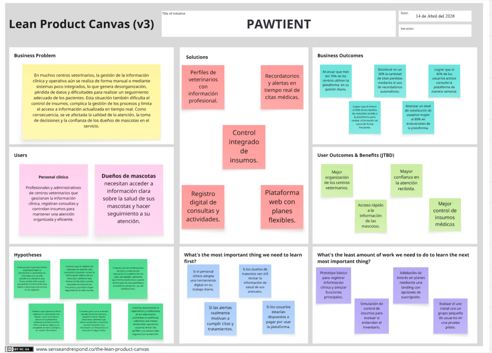

**Enlace al Lean UX Canvas:** [*Ver en Miro*](https://miro.com/app/board/uXjVGi5z7Cc=/?share_link_id=122548882114)

---

## 1.3. Segmentos objetivo

En el análisis del segmento objetivo para Pawtient, se ha identificado que nuestros principales usuarios serán el personal clínico de los centros veterinarios y los dueños de mascotas.

### Personal de clínico de centros veterinarios

Incluye veterinarios y personal administrativo, quienes necesitan gestionar la información clínica, registrar consultas, controlar insumos y organizar los procesos del centro de forma eficiente.

- **Edad:** 20 a 60 años

- **Necesidad clave:** Centralizar información clínica y optimizar la gestión del centro.

- **Nivel educativo:** Formación técnica o profesional

- **Uso de tecnología:** Uso frecuente de computadoras y dispositivos móviles.

### Dueños de mascotas

Los dueños de mascotas buscan estar informados sobre la salud de sus mascotas y entender mejor la atención que reciben. Muchas veces no cuentan con acceso a esta.

- **Edad:** 18 a 60 años

- **Necesidad clave:** Consultar el estado de salud de sus mascotas.

- **Nivel educativo:** Variado

- **Uso de tecnología:** Uso frecuente de teléfonos móviles.

---

# Capítulo II: Requirements Elicitation & Analysis

---

## 2.1. Competidores

> *(Identificar y describir mínimo 3 competidores directos o indirectos con modelos de negocio basados en productos digitales similares)*

### 2.1.1. Análisis competitivo

**¿Por qué llevar a cabo este análisis?**
*(Escribir la pregunta que busca responder o el objetivo de este análisis)*

#### Competitive Analysis Landscape

| | **BrandRadar** | **Competidor 1** | **Competidor 2** | **Competidor 3** |
|:--|:--:|:--:|:--:|:--:|
| **Logo** | *(logo)* | *(logo)* | *(logo)* | *(logo)* |
| **Overview** | | | | |
| **Ventaja competitiva** | | | | |
| **Mercado objetivo** | | | | |
| **Estrategias de marketing** | | | | |
| **Productos & Servicios** | | | | |
| **Precios & Costos** | | | | |
| **Canales de distribución** | | | | |
| **Fortalezas** | | | | |
| **Debilidades** | | | | |
| **Oportunidades** | | | | |
| **Amenazas** | | | | |

---

### 2.1.2. Estrategias y tácticas frente a competidores

*(Describir las estrategias y tácticas preliminares que aplicará el startup para afrontar las fortalezas y aprovechar las debilidades de los competidores, así como el contexto de oportunidades y amenazas)*

---

## 2.2. Entrevistas

> *(Investigación basada en recolección de información mediante entrevistas a representantes de los segmentos objetivo)*

### 2.2.1. Diseño de entrevistas

*(Incluir las preguntas principales y complementarias para entrevistas, dirigidas a cada segmento objetivo)*

**Segmento objetivo 1: `[Nombre del segmento]`**

*Preguntas principales:*
1. *(Pregunta 1)*
2. *(Pregunta 2)*
3. *(Pregunta 3)*

*Preguntas complementarias:*
1. *(Pregunta complementaria 1)*
2. *(Pregunta complementaria 2)*

---

**Segmento objetivo 2: `[Nombre del segmento]`**

*Preguntas principales:*
1. *(Pregunta 1)*
2. *(Pregunta 2)*
3. *(Pregunta 3)*

*Preguntas complementarias:*
1. *(Pregunta complementaria 1)*
2. *(Pregunta complementaria 2)*

---

### 2.2.2. Registro de entrevistas

  
**Segmento objetivo 1: `nombre del segmento`**

 

#### Entrevista 1
*Imagen de la entrevista*

 

| Campo | Detalle |
|:------|:--------|
| **Nombres y apellidos** | `[Nombre del entrevistado]` |
| **Edad** | `[Edad]` |
| **Ubicación** | `[Distrito]` |
| **Fecha de entrevista** | `YYYY-MM-DD` |
| **Duración** | `[HH:MM]` |
| **Enlace al video** | [Ver entrevista en Microsoft Stream](`URL`) — Inicia en `[MM:SS]` |

**Resumen:**

*(Redactar resumen de la entrevista)*

 

  
#### Entrevista 2
*Imagen de la entrevista*

 

| Campo | Detalle |
|:------|:--------|
| **Nombres y apellidos** | `[Nombre del entrevistado]` |
| **Edad** | `[Edad]` |
| **Ubicación** | `[Distrito]` |
| **Fecha de entrevista** | `YYYY-MM-DD` |
| **Duración** | `[HH:MM]` |
| **Enlace al video** | [Ver entrevista en Microsoft Stream](`URL`) — Inicia en `[MM:SS]` |

**Resumen:**

*(Redactar resumen de la entrevista)*

 

  
#### Entrevista 3

*Imagen de la entrevista*

 

| Campo | Detalle |
|:------|:--------|
| **Nombres y apellidos** | `[Nombre del entrevistado]` |
| **Edad** | `[Edad]` |
| **Ubicación** | `[Distrito]` |
| **Fecha de entrevista** | `YYYY-MM-DD` |
| **Duración** | `[HH:MM]` |
| **Enlace al video** | [Ver entrevista en Microsoft Stream](`URL`) — Inicia en `[MM:SS]` |

**Resumen:**

*Redactar resumen de la entrevista*

---

  
**Segmento objetivo 2: `nombre del segmento`**

 

#### Entrevista 1

*Imagen de la entrevista*

 

| Campo | Detalle |
|:------|:--------|
| **Nombres y apellidos** | `[Nombre del entrevistado]` |
| **Edad** | `[Edad]` |
| **Ubicación** | `[Distrito]` |
| **Fecha de entrevista** | `YYYY-MM-DD` |
| **Duración** | `[HH:MM]` |
| **Enlace al video** | [Ver entrevista en Microsoft Stream](`URL`) — Inicia en `[MM:SS]` |

**Resumen:**

*(Redactar de forma descriptiva las respuestas del entrevistado a las preguntas realizadas. Incluir todas las características objetivas y subjetivas: personalidad, marcas e influencias, tecnología, canales de interacción, browser, dispositivos, etc.)*

 

  
#### Entrevista 2

*Imagen de la entrevista*

 

| Campo | Detalle |
|:------|:--------|
| **Nombres y apellidos** | `[Nombre del entrevistado]` |
| **Edad** | `[Edad]` |
| **Ubicación** | `[Distrito]` |
| **Fecha de entrevista** | `YYYY-MM-DD` |
| **Duración** | `[HH:MM]` |
| **Enlace al video** | [Ver entrevista en Microsoft Stream](`URL`) — Inicia en `[MM:SS]` |

**Resumen:**

*(Redactar resumen de la entrevista)*

 

#### Entrevista 3

*Imagen de la entrevista*

 

| Campo | Detalle |
|:------|:--------|
| **Nombres y apellidos** | `[Nombre del entrevistado]` |
| **Edad** | `[Edad]` |
| **Ubicación** | `[Distrito]` |
| **Fecha de entrevista** | `YYYY-MM-DD` |
| **Duración** | `[HH:MM]` |
| **Enlace al video** | [Ver entrevista en Microsoft Stream](`URL`) — Inicia en `[MM:SS]` |

**Resumen:**

*(Redactar resumen de la entrevista)*

---

### 2.2.3. Análisis de entrevistas

> *(Análisis por segmento objetivo con sustento estadístico — porcentajes)*

**Segmento objetivo 1: `[Nombre del segmento]`**

*(Identificar con sustento estadístico todas las características objetivas y subjetivas representativas del segmento, necesarias para la construcción de los arquetipos)*

**Segmento objetivo 2: `[Nombre del segmento]`**

*(Identificar con sustento estadístico todas las características objetivas y subjetivas representativas del segmento, necesarias para la construcción de los arquetipos)*

---

## 2.3. Needfinding

### 2.3.1. User Personas

Los siguientes User Personas se elaboraron a partir de las entrevistas realizadas, representando a los principales segmentos del proyecto. Cada uno sintetiza características, comportamientos y necesidades que orientan el diseño y la propuesta de valor de la plataforma.

User Persona 1: Personal clínico veterinario

Sebastián Navarro es un veterinario joven que trabaja en una clínica y atiende a varios pacientes al día. Su principal reto es organizar la información clínica, gestionar citas e insumos y optimizar su tiempo, por lo que busca herramientas digitales que le permitan trabajar de manera más eficiente.

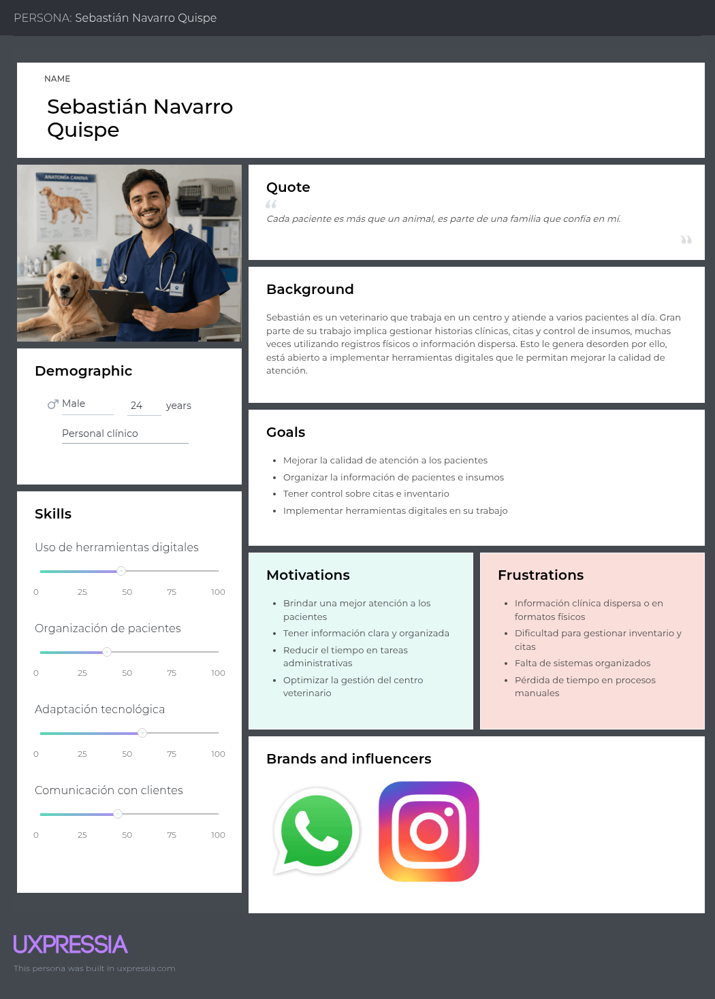

User Persona 2: Dueña de mascota

Camila Rodríguez es una joven dueña de mascota que busca mantener la salud de su perro bajo control. Su principal dificultad es no contar con información clara y centralizada, por lo que valora soluciones simples que le permitan hacer seguimiento y tomar decisiones con mayor seguridad.

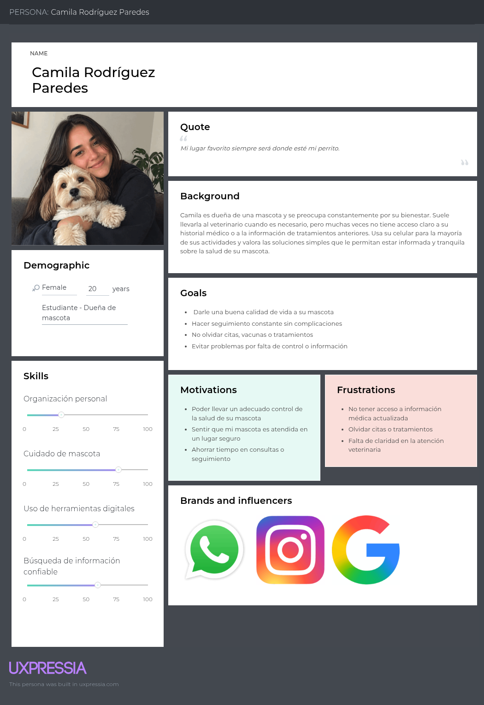

---

### 2.3.2. User Task Matrix

##### User Task Matrix - Personal clínico 

| **Tareas / Tasks**                   | **Frecuencia** | **Importancia** |
|--------------------------------------|----------------|-----------------|
| Registrar historias clínicas         | Alta           | Muy alta        |
| Consultar información de pacientes   | Alta           | Muy alta        |
| Gestionar citas                      | Alta           | Alta            |
| Controlar inventario de insumos      | Media          | Alta            |
| Coordinar atención con clientes      | Alta           | Muy alta        |
| Revisar stock de insumos             | Media          | Alta            |
| Organizar información clínica        | Alta           | Muy alta        |
| Realizar seguimiento de tratamientos | Media          | Alta            |
| Comunicar indicaciones a los dueños  | Alta           | Alta            |

El personal clínico desarrolla tareas constantes enfocadas en el registro, consulta y gestión de información médica, así como en la coordinación de citas y control de insumos. Lo que refleja la necesidad de sistemas que centralicen la información y optimicen el tiempo de trabajo.

##### User Task Matrix - Dueños de mascotas

| **Tareas / Tasks**                          | **Frecuencia** | **Importancia** |
|---------------------------------------------|----------------|-----------------|
| Llevar a su mascota al veterinario          | Media          | Muy alta        |
| Recordar vacunas y tratamiento              | Media          | Muy alta        |
| Consultar información respecto a su mascota | Alta           | Alta            |
| Organizar citas veterinarias                | Media          | Alta            |
| Verificar el estado de salud de su mascota  | Alta           | Muy alta        |
| Revisar historial antes de una consulta     | Baja           | Alta            |
| Comprar productos para su mascota           | Media          | Media           |
| Consultar reseñas de veterinarias           | Alta           | Alta            |
| Registrar o guardar información médica      | Baja           | Alta            |

Los dueños de mascotas realizan actividades para asegurar su bienestar, vigilar su estado y tomar decisiones sobre su salud. Las tareas principales incluyen administrar vacunas, buscar información confiable y agendar visitas, lo que resalta la necesidad de herramientas para llevar un registro y evitar la pérdida de información.

---

### 2.3.3. User Journey Mapping

En el desarrollo de Pawtient, se elaboró un user journey mapping con el fin de comprender como es que interactúan los dueños de mascotas y el personal clínico en el contexto de atención veterinaria. Analizamos las distintas etapas que atraviesan, desde la detección de un problema hasta el seguimiento posterior al tratamiento, identificando dificultades y oportunidades de mejora. Este análisis nos permite plantear una solución que se integra de forma natural en sus actividades diarias, facilitando el acceso a la información, mejorando la organización de los procesos y fortaleciendo la calidad de la atención.

**User Journey Map — Personal clínico**

[Ver Imagen](https://raw.githubusercontent.com/PetHealt/Pawtient-report/refs/heads/feature/sprint1-emily/pawtient-report/assets/images/Journey%20Mapping/Journey-mapping-segment-1.png)

---

**User Journey Map — Dueños de mascotas**

[Ver Imagen](https://raw.githubusercontent.com/PetHealt/Pawtient-report/refs/heads/feature/sprint1-emily/pawtient-report/assets/images/Journey%20Mapping/Journey-mapping-segment-2.png)

---

### 2.3.4. Empathy Mapping

En esta sección se presentarán los Empathy Maps de cada segmento objetivo, construidos a partir de los User Persona previamente definidos. Esta herramienta permite analizar de forma integral lo que los usuarios piensan, sienten, dicen y hacen, facilitando la identificación de sus necesidades, frustraciones y motivaciones. De esta manera, se obtienen insights clave que orientan el diseño de la solución propuesta.

**Empathy Map — Personal clínico**

[Ver Imagen](https://raw.githubusercontent.com/PetHealt/Pawtient-report/refs/heads/feature/sprint1-emily/pawtient-report/assets/images/Empathy%20Mapping/Empathy-map-segment-1.png)

---

**Empathy Map — Dueños de mascotas**

[Ver Imagen](https://raw.githubusercontent.com/PetHealt/Pawtient-report/refs/heads/feature/sprint1-emily/pawtient-report/assets/images/Empathy%20Mapping/Empathy-map-segment-2.png)

---

## 2.4. Big Picture Event Storming

---

## 2.5. Ubiquitous Language

>*A continuación se presenta el glosario de términos clave utilizados en el dominio del sistema **Pawtient**, orientado a la gestión de clínicas veterinarias. Este lenguaje común permite una comunicación clara y sin ambigüedades entre todos los stakeholders: veterinarios, administradores, dueños de mascotas y el equipo de desarrollo.*

 

## Actores del dominio

| Término (EN) | Término (ES) | Definición |
|:---|:---|:---|
| `Veterinarian / Admin` | Veterinario / Administrador | Usuario interno de la clínica con privilegios para gestionar citas, consultas, inventario y reportes. En el sistema se identifica como un único rol con acceso completo. |
| `Pet Owner` | Dueño de mascota | Persona externa responsable de una o más mascotas registradas. Puede iniciar sesión para consultar información, pero no tiene acceso administrativo. |
| `Supplier` | Proveedor | Entidad externa que abastece insumos médicos a la clínica. Puede ser registrado, editado o eliminado por el veterinario/admin. |

 

## Gestión de clínica y usuarios

| Término (EN) | Término (ES) | Definición |
|:---|:---|:---|
| `Clinic` | Clínica | Entidad principal del sistema que agrupa veterinarios, mascotas, citas e inventario bajo una misma organización. |
| `Subscription Plan` | Plan de suscripción | Plan comercial que determina las funcionalidades habilitadas para una clínica (ej. Paw Basic). Activado al registrar la clínica. |
| `User Account` | Cuenta de usuario | Credenciales de acceso al sistema, asociadas a un rol (veterinario/admin o dueño de mascota). |
| `Session` | Sesión | Período activo de uso del sistema tras autenticación exitosa. |
| `Access Data` | Datos de acceso | Información guardada localmente para facilitar el inicio de sesión recurrente. |

 

## Mascotas y pacientes

| Término (EN) | Término (ES) | Definición |
|:---|:---|:---|
| `Pet` | Mascota | Animal registrado en el sistema, asociado a un dueño de mascota. Es la unidad de atención clínica. |
| `Patient` | Paciente | Mascota en el contexto de una consulta médica activa. El término se usa cuando la mascota está siendo atendida. |
| `Triage` | Triaje | Proceso de valoración inicial del paciente al ingresar a consulta, donde se registran signos vitales básicos. |
| `Vital Signs` | Signos vitales | Mediciones fisiológicas registradas durante el triaje (temperatura, peso, frecuencia cardíaca, etc.). |

 

## Citas y agenda

| Término (EN) | Término (ES) | Definición |
|:---|:---|:---|
| `Appointment` | Cita | Reserva programada para la atención de un paciente en una fecha y hora específica. |
| `Availability` | Disponibilidad | Configuración de horarios en los que un veterinario puede recibir citas. |
| `Appointment Request` | Solicitud de cita | Acción del dueño de mascota de pedir una cita. Inicia el flujo de confirmación. |
| `Confirmed Appointment` | Cita confirmada | Cita que ha sido aceptada y agendada formalmente. |
| `Cancelled Appointment` | Cita cancelada | Cita que fue anulada antes de realizarse. Genera una pregunta de negocio: ¿se bloquea al usuario si cancela con poca anticipación? |
| `Rescheduled Appointment` | Cita reprogramada | Cita que fue modificada a una nueva fecha u hora. |
| `Appointment Reminder` | Recordatorio de cita | Notificación enviada automáticamente al dueño de mascota antes de la cita. |

 

## Consulta médica

| Término (EN) | Término (ES) | Definición |
|:---|:---|:---|
| `Medical Consultation` | Consulta médica | Atención clínica realizada durante una cita donde el veterinario evalúa al paciente. Comienza con el triaje y finaliza con el cierre de la consulta. |
| `Diagnosis` | Diagnóstico | Identificación de una enfermedad o condición médica, emitida por el veterinario tras la evaluación. |
| `Prescription` | Receta médica | Documento generado por el veterinario que especifica medicamentos, dosis y duración del tratamiento. |
| `Medical Exam` | Examen médico | Estudio complementario solicitado durante la consulta (ej. análisis de sangre, rayos X). Se adjunta como archivo al historial. |
| `Lab Result` | Resultado de laboratorio | Resultado de un examen médico. Puede cargarse como PDF o JPG al historial del paciente. |
| `Closed Consultation` | Consulta finalizada | Estado de la consulta una vez que el veterinario ha completado el diagnóstico, emitido receta y adjuntado exámenes si aplica. |
| `Medical History` | Historial médico | Registro acumulado de todas las consultas, diagnósticos, recetas y exámenes de un paciente a lo largo del tiempo. |
| `Shared Medical History` | Historial compartido | Historial médico enviado/entregado al dueño de mascota al finalizar la consulta. |

 

## Inventario y suministros

| Término (EN) | Término (ES) | Definición |
|:---|:---|:---|
| `Medical Supply` | Insumo médico | Producto utilizado en la clínica: medicamentos, materiales de uso clínico, etc. Registrado con un stock inicial. |
| `Initial Stock` | Stock inicial | Cantidad definida al registrar un insumo médico por primera vez en el sistema. |
| `Stock Adjustment` | Ajuste de inventario | Modificación manual del nivel de stock de un insumo, registrada por el veterinario/admin. |
| `Critical Stock Alert` | Alerta de stock crítico | Notificación generada automáticamente cuando el stock de un insumo cae por debajo del umbral mínimo. |
| `Discounted Medication` | Medicamento descontado | Medicamento dispensado al paciente durante una consulta, que descuenta unidades del inventario automáticamente. |
| `Supply Expense` | Gasto de insumos | Registro del costo asociado al uso o compra de insumos. Aparece en los reportes financieros. |

 

## Proveedores

| Término (EN) | Término (ES) | Definición |
|:---|:---|:---|
| `Added Supplier` | Proveedor agregado | Proveedor nuevo registrado en el sistema. |
| `Edited Supplier` | Proveedor editado | Proveedor cuya información fue actualizada. |
| `Deleted Supplier` | Proveedor eliminado | Proveedor removido del sistema. Acción irreversible. |

 

## Facturación y reportes

| Término (EN) | Término (ES) | Definición |
|:---|:---|:---|
| `Service Invoice` | Boleta de atención | Documento generado al finalizar una consulta que detalla los servicios prestados y su costo. |
| `Client Payment` | Pago de cliente | Registro del pago efectuado por el dueño de mascota, asociado a una boleta de atención. |
| `Cancelled Sale` | Venta cancelada | Registro de una transacción que fue anulada antes o después de la emisión de la boleta. |
| `Income Report` | Reporte de ingresos | Reporte generado que consolida los ingresos de la clínica en un período determinado. |
| `Supply Expense Report` | Reporte de gastos de insumos | Reporte que detalla el consumo y costo de los insumos utilizados en un período. |

 

## Eventos del dominio (Domain Events)

Los siguientes son los eventos significativos identificados en el Event Storming. Representan hechos ocurridos en el sistema que tienen impacto en el negocio:

| Evento (EN) | Evento (ES) | Bounded Context |
|:---|:---|:---|
| `ClinicRegistered` | Clínica registrada | Gestión de clínica |
| `SubscriptionPlanActivated` | Plan de suscripción activado | Gestión de clínica |
| `UserRegistered` | Usuario registrado | Gestión de usuarios |
| `SessionStarted` | Sesión iniciada | Gestión de usuarios |
| `AccessDataSaved` | Datos de acceso guardados | Gestión de usuarios |
| `PetOwnerAccountRegistered` | Cuenta de dueño registrada | Gestión de usuarios |
| `PetRegistered` | Mascota registrada | Mascotas |
| `AvailabilityConfigured` | Disponibilidad configurada | Agenda |
| `AppointmentRequested` | Cita solicitada | Agenda |
| `AppointmentConfirmed` | Cita confirmada | Agenda |
| `AppointmentCancelled` | Cita cancelada | Agenda |
| `AppointmentRescheduled` | Cita reprogramada | Agenda |
| `AppointmentReminderSent` | Recordatorio de cita enviado | Agenda |
| `PatientAdmittedToTriage` | Paciente ingresado a triaje | Consulta médica |
| `VitalSignsRegistered` | Signos vitales registrados | Consulta médica |
| `MedicalConsultationStarted` | Consulta médica iniciada | Consulta médica |
| `DiagnosisIssued` | Diagnóstico emitido | Consulta médica |
| `PrescriptionGenerated` | Receta médica generada | Consulta médica |
| `MedicalExamAttached` | Examen adjuntado | Consulta médica |
| `ConsultationClosed` | Consulta finalizada | Consulta médica |
| `MedicalHistoryShared` | Historial médico compartido | Consulta médica |
| `SupplierAdded` | Proveedor agregado | Inventario |
| `SupplierEdited` | Proveedor editado | Inventario |
| `SupplierDeleted` | Proveedor eliminado | Inventario |
| `MedicalSupplyRegistered` | Insumo médico registrado | Inventario |
| `InitialStockDefined` | Stock inicial definido | Inventario |
| `MedicationDispensed` | Medicamento descontado por venta | Inventario |
| `CriticalStockAlertGenerated` | Alerta de stock crítico generada | Inventario |
| `StockAdjustmentMade` | Ajuste de inventario realizado | Inventario |
| `ServiceInvoiceGenerated` | Boleta de atención generada | Facturación |
| `ClientPaymentRegistered` | Pago de cliente registrado | Facturación |
| `SaleCancelled` | Venta cancelada | Facturación |
| `IncomeReportGenerated` | Reporte de ingresos generado | Facturación |
| `SupplyExpenseRegistered` | Gasto de insumos registrado | Facturación |

 

---

# Capítulo III: Requirements Specification

---

## 3.1. User Stories

>*Las User Stories fueron definidas a partir del análisis de entrevistas realizadas a los dos segmentos objetivo: personal clínico de centros veterinarios y dueños de mascotas. Se incluyen además User Stories para la Landing Page y Technical Stories para el RESTful API. Los criterios de aceptación siguen la estructura Gherkin (Given–When–Then) y están redactados en tiempo presente, tercera persona, sin referencias a detalles de interfaz de usuario.*

 

| Epic / Story ID | Título | Descripción | Criterios de Aceptación | Relacionado con (Epic ID) |
|---|---|---|---|---|
| **EP01** | **Autenticación y Gestión de Usuarios** | Proveer un sistema seguro de registro, inicio de sesión y gestión de roles para veterinarios, administradores de clínica y dueños de mascotas. | — | — |
| US01 | Registrar cuenta como veterinario | Como veterinario, quiero crear una cuenta en Pawtient con mis datos profesionales para acceder a las funcionalidades del sistema de gestión clínica. | **Escenario 1 – Registro exitoso:**   **Given** que el veterinario completa todos los campos obligatorios (nombre, apellido, correo, contraseña y número de colegiatura),   **When** envía el formulario de registro,   **Then** el sistema crea la cuenta, envía un correo de verificación y muestra un mensaje de confirmación.    **Escenario 2 – Correo ya registrado:**   **Given** que el veterinario ingresa un correo electrónico que ya existe en el sistema,   **When** envía el formulario,   **Then** el sistema muestra el mensaje "El correo ya está registrado" y no crea una cuenta duplicada.    **Escenario 3 – Contraseña débil:**   **Given** que el veterinario ingresa una contraseña que no cumple los requisitos mínimos de seguridad,   **When** envía el formulario,   **Then** el sistema resalta los requisitos incumplidos y no permite que el registro continúe. | EP01 |
| US02 | Iniciar sesión en la plataforma | Como usuario registrado (veterinario, administrador o dueño de mascota), quiero iniciar sesión con mis credenciales para acceder a las funcionalidades según mi rol. | **Escenario 1 – Inicio de sesión exitoso:**   **Given** que el usuario ingresa un correo y contraseña válidos,   **When** confirma el inicio de sesión,   **Then** el sistema autentica al usuario, genera un token de sesión y lo redirige al panel correspondiente a su rol.    **Escenario 2 – Credenciales incorrectas:**   **Given** que el usuario ingresa una contraseña incorrecta,   **When** intenta iniciar sesión,   **Then** el sistema muestra el mensaje "Credenciales inválidas" sin especificar cuál campo es incorrecto y deniega el acceso.    **Escenario 3 – Cuenta no verificada:**   **Given** que el usuario registrado no ha verificado su correo electrónico,   **When** intenta iniciar sesión,   **Then** el sistema informa que la cuenta requiere verificación y ofrece reenviar el correo de confirmación. | EP01 |
| US03 | Recuperar contraseña olvidada | Como usuario registrado, quiero recuperar el acceso a mi cuenta en caso de olvidar mi contraseña para no perder el acceso a la plataforma. | **Escenario 1 – Correo de recuperación enviado:**   **Given** que el usuario ingresa su correo registrado en el formulario de recuperación,   **When** confirma la solicitud,   **Then** el sistema envía un enlace de restablecimiento de contraseña válido por 30 minutos.    **Escenario 2 – Correo no registrado:**   **Given** que el usuario ingresa un correo que no existe en el sistema,   **When** confirma la solicitud,   **Then** el sistema muestra el mensaje genérico "Si el correo está registrado, recibirás un enlace" sin confirmar ni negar la existencia de la cuenta.    **Escenario 3 – Enlace expirado:**   **Given** que el usuario intenta usar un enlace de recuperación después de los 30 minutos de validez,   **When** accede al enlace,   **Then** el sistema indica que el enlace ha expirado y permite solicitar uno nuevo. | EP01 |
| **EP02** | **Gestión de Historiales Clínicos** | Centralizar los registros médicos de las mascotas en formato digital, eliminando el uso de historias en papel o Excel y permitiendo el acceso desde dispositivos móviles. | — | — |
| US04 | Registrar historia clínica de mascota | Como veterinario, quiero crear y guardar la historia clínica digital de una mascota para eliminar el uso de registros físicos y acceder a la información desde cualquier dispositivo. | **Escenario 1 – Registro exitoso:**   **Given** que el veterinario completa todos los campos obligatorios (nombre de mascota, especie, raza, peso, diagnóstico, tratamiento y fecha),   **When** confirma el guardado,   **Then** el sistema almacena el registro y muestra un mensaje de confirmación.    **Escenario 2 – Campos incompletos:**   **Given** que el veterinario intenta guardar una historia clínica con campos obligatorios vacíos,   **When** confirma el guardado,   **Then** el sistema resalta los campos faltantes y no permite continuar hasta completarlos.    **Escenario 3 – Acceso desde dispositivo móvil:**   **Given** que el veterinario accede al sistema desde un dispositivo móvil,   **When** crea o consulta una historia clínica,   **Then** el sistema muestra el formulario completo y funcional sin pérdida de campos ni funcionalidades. | EP02 |
| US05 | Consultar historial médico de una mascota | Como veterinario, quiero buscar y visualizar el historial completo de una mascota para tomar decisiones clínicas informadas durante la consulta. | **Escenario 1 – Búsqueda por nombre de mascota:**   **Given** que el veterinario ingresa el nombre de la mascota en el buscador del módulo de historiales,   **When** el sistema procesa la búsqueda,   **Then** muestra los registros coincidentes ordenados cronológicamente de forma descendente.    **Escenario 2 – Sin resultados:**   **Given** que el veterinario realiza una búsqueda,   **When** no existe ningún registro con ese nombre,   **Then** el sistema muestra el mensaje "No se encontraron registros" y ofrece la opción de crear uno nuevo.    **Escenario 3 – Visualización de vacunas aplicadas:**   **Given** que el veterinario abre el historial de una mascota,   **When** navega a la sección de vacunación,   **Then** el sistema lista todas las vacunas aplicadas con fecha de aplicación, número de lote y fecha de próxima dosis. | EP02 |
| US06 | Editar y actualizar historia clínica | Como veterinario, quiero actualizar la historia clínica de una mascota después de cada consulta para mantener la información vigente y con trazabilidad de cambios. | **Escenario 1 – Actualización exitosa:**   **Given** que el veterinario abre un registro existente y modifica el diagnóstico o tratamiento,   **When** guarda los cambios,   **Then** el sistema registra la actualización incluyendo la fecha, hora y nombre del usuario que realizó el cambio.    **Escenario 2 – Edición sin permisos:**   **Given** que un usuario sin rol de veterinario intenta editar una historia clínica,   **When** intenta acceder al modo de edición,   **Then** el sistema deniega la acción y muestra el mensaje "No tienes permisos para editar este registro".    **Escenario 3 – Historial de cambios visible:**   **Given** que el veterinario revisa una historia clínica,   **When** accede a la sección de trazabilidad,   **Then** el sistema muestra un registro cronológico de todas las modificaciones realizadas con nombre del autor y fecha. | EP02 |
| US07 | Registrar vacunas aplicadas | Como veterinario, quiero registrar cada vacuna aplicada durante una consulta vinculándola al historial de la mascota para mantener un calendario de vacunación actualizado. | **Escenario 1 – Registro de vacuna exitoso:**   **Given** que el veterinario completa los campos de vacunación (nombre de vacuna, lote, fecha de aplicación y próxima dosis),   **When** confirma el registro,   **Then** el sistema guarda la entrada y la añade al historial de vacunación de la mascota.    **Escenario 2 – Fecha de próxima dosis en el pasado:**   **Given** que el veterinario ingresa una fecha de próxima dosis anterior a la fecha actual,   **When** intenta guardar,   **Then** el sistema muestra una advertencia indicando que la fecha corresponde al pasado y solicita confirmación para continuar.    **Escenario 3 – Programación automática de recordatorio:**   **Given** que se registra una vacuna con fecha de próxima dosis,   **When** el sistema confirma el guardado,   **Then** programa automáticamente un recordatorio para notificar al dueño 7 días antes de la fecha indicada. | EP02 |
| **EP03** | **Programación y Gestión de Citas** | Digitalizar y automatizar la agenda de citas para reducir el estrés del personal clínico y mejorar la experiencia del dueño de mascota. | — | — |
| US08 | Agendar cita desde la clínica | Como veterinario, quiero registrar una nueva cita en el sistema para organizar la agenda diaria sin depender de llamadas manuales ni registros en papel. | **Escenario 1 – Cita registrada correctamente:**   **Given** que el veterinario selecciona fecha, hora, veterinario asignado y mascota del cliente,   **When** confirma el registro,   **Then** el sistema añade la cita al calendario y envía automáticamente una notificación al dueño de la mascota.    **Escenario 2 – Horario no disponible:**   **Given** que el veterinario selecciona un horario ya ocupado por el mismo profesional,   **When** intenta confirmar,   **Then** el sistema indica la no disponibilidad y sugiere los próximos horarios libres.    **Escenario 3 – Cita fuera del horario de atención:**   **Given** que el veterinario intenta registrar una cita fuera del horario configurado por la clínica,   **When** intenta confirmar,   **Then** el sistema muestra una advertencia indicando que el horario seleccionado está fuera del rango configurado. | EP03 |
| US09 | Agendar cita como dueño de mascota | Como dueño de mascota, quiero solicitar una cita veterinaria desde mi celular para evitar llamadas telefónicas y reducir el tiempo invertido en coordinar turnos. | **Escenario 1 – Solicitud enviada exitosamente:**   **Given** que el dueño selecciona una clínica, una de sus mascotas registradas y una fecha y hora disponibles,   **When** confirma la solicitud,   **Then** el sistema registra la cita y envía una confirmación mediante notificación push.    **Escenario 2 – Sin horarios disponibles en la fecha seleccionada:**   **Given** que el dueño selecciona una fecha en la que todos los horarios están ocupados,   **When** intenta avanzar,   **Then** el sistema muestra el mensaje "No hay horarios disponibles para esta fecha" y permite seleccionar otra.    **Escenario 3 – Cancelación con anticipación:**   **Given** que el dueño tiene una cita confirmada y la cancela con al menos 2 horas de anticipación,   **When** confirma la cancelación,   **Then** el sistema libera el horario, notifica a la clínica y elimina los recordatorios asociados. | EP03 |
| US10 | Visualizar agenda del día | Como veterinario, quiero ver un resumen de las citas programadas para el día en curso para organizar mi jornada de trabajo de forma eficiente. | **Escenario 1 – Visualización correcta de la agenda:**   **Given** que el veterinario accede al panel principal,   **When** selecciona la vista de agenda diaria,   **Then** el sistema lista todas las citas del día ordenadas por hora con nombre de mascota, dueño y motivo de consulta.    **Escenario 2 – Agenda vacía:**   **Given** que no existen citas programadas para el día en curso,   **When** el veterinario accede a la agenda,   **Then** el sistema muestra el mensaje "No hay citas programadas para hoy".    **Escenario 3 – Filtro por veterinario:**   **Given** que la clínica tiene múltiples veterinarios,   **When** el administrador aplica un filtro por un profesional específico,   **Then** el sistema muestra únicamente las citas asignadas a ese veterinario. | EP03 |
| US11 | Recibir recordatorios de citas | Como dueño de mascota, quiero recibir recordatorios automáticos antes de las citas de mi mascota para no olvidar los turnos médicos. | **Escenario 1 – Recordatorio 24 horas antes:**   **Given** que existe una cita confirmada,   **When** faltan 24 horas para la cita,   **Then** el sistema envía una notificación push al dueño con la fecha, hora, nombre de la clínica y veterinario asignado.    **Escenario 2 – Recordatorio 1 hora antes:**   **Given** que existe una cita confirmada,   **When** falta 1 hora para la cita,   **Then** el sistema envía un segundo recordatorio de confirmación al dueño.    **Escenario 3 – Recordatorios desactivados por el usuario:**   **Given** que el dueño ha desactivado los recordatorios de citas en su configuración,   **When** el sistema evalúa el envío de una alerta,   **Then** no envía ninguna notificación para ese tipo de evento. | EP03 |
| **EP04** | **Trazabilidad de Suministros e Inventario** | Proveer control en tiempo real del inventario de medicamentos e insumos para evitar faltantes, vencimientos y errores operativos en la clínica. | — | — |
| US12 | Registrar ingreso de suministros | Como administrador de clínica, quiero registrar el ingreso de nuevos suministros al inventario para mantener el stock actualizado en tiempo real. | **Escenario 1 – Ingreso registrado exitosamente:**   **Given** que el administrador completa los campos de nombre del producto, cantidad, unidad, fecha de vencimiento y proveedor,   **When** confirma el registro,   **Then** el sistema actualiza el stock y registra la transacción con fecha y usuario responsable.    **Escenario 2 – Producto ya existente en inventario:**   **Given** que el administrador registra un suministro con el mismo nombre que uno existente,   **When** confirma el ingreso,   **Then** el sistema suma la cantidad al stock existente sin crear un registro duplicado.    **Escenario 3 – Alerta de producto próximo a vencer:**   **Given** que un producto tiene fecha de vencimiento dentro de los próximos 30 días,   **When** el administrador lo registra,   **Then** el sistema genera una alerta visible en el panel principal indicando la proximidad del vencimiento. | EP04 |
| US13 | Consultar niveles de stock | Como veterinario, quiero consultar el nivel actual de un suministro para verificar disponibilidad antes de prescribir un tratamiento. | **Escenario 1 – Consulta exitosa:**   **Given** que el veterinario busca un suministro por nombre en el módulo de inventario,   **When** el producto existe,   **Then** el sistema muestra la cantidad disponible, la unidad de medida y la fecha de vencimiento más próxima.    **Escenario 2 – Stock mínimo alcanzado:**   **Given** que el stock de un suministro cae por debajo del nivel mínimo definido,   **When** el sistema realiza la verificación periódica,   **Then** genera una alerta y notifica al administrador de la clínica.    **Escenario 3 – Producto sin existencia:**   **Given** que el veterinario busca un suministro cuyo stock es cero,   **When** el sistema responde a la consulta,   **Then** muestra el mensaje "Sin stock disponible" junto con la fecha del último ingreso registrado. | EP04 |
| US14 | Registrar consumo de suministros por consulta | Como veterinario, quiero registrar los insumos utilizados durante una consulta para descontarlos automáticamente del inventario y mantener la trazabilidad de uso. | **Escenario 1 – Descuento automático de inventario:**   **Given** que el veterinario registra los insumos usados al cerrar una consulta,   **When** guarda el registro,   **Then** el sistema descuenta las cantidades del inventario y vincula la transacción al historial clínico de la mascota.    **Escenario 2 – Cantidad solicitada supera el stock disponible:**   **Given** que el veterinario intenta registrar una cantidad que supera el stock actual,   **When** intenta guardar,   **Then** el sistema muestra una alerta de stock insuficiente y no permite completar el registro hasta corregir la cantidad.    **Escenario 3 – Reporte de consumo mensual:**   **Given** que el administrador accede al módulo de reportes y selecciona el período mensual,   **When** genera el reporte,   **Then** el sistema presenta un detalle de consumo por insumo con cantidad total utilizada y costo estimado. | EP04 |
| US15 | Generar alertas de reabastecimiento | Como administrador de clínica, quiero recibir alertas automáticas cuando el stock de un suministro sea bajo para solicitar reposición con anticipación y evitar faltantes. | **Escenario 1 – Alerta generada automáticamente:**   **Given** que el stock de un suministro desciende al nivel mínimo configurado,   **When** el sistema procesa la transacción de descuento,   **Then** genera una alerta visible en el panel del administrador con el nombre del suministro y la cantidad actual.    **Escenario 2 – Configuración del nivel mínimo:**   **Given** que el administrador edita la ficha de un suministro e ingresa un nivel mínimo de stock,   **When** guarda la configuración,   **Then** el sistema utiliza ese valor como umbral para las futuras alertas de reabastecimiento.    **Escenario 3 – Alerta de vencimiento masivo:**   **Given** que varios suministros tienen fecha de vencimiento dentro de los próximos 15 días,   **When** el sistema ejecuta la revisión diaria,   **Then** agrupa las alertas en una sola notificación que lista todos los productos afectados. | EP04 |
| **EP05** | **Perfiles y Gestión de Mascotas** | Permitir a los dueños gestionar el perfil digital de sus mascotas con historial, vacunas y documentos accesibles desde el celular. | — | — |
| US16 | Crear perfil digital de mascota | Como dueño de mascota, quiero registrar el perfil de mi mascota en la plataforma para centralizar su información médica y acceder a ella en cualquier momento. | **Escenario 1 – Perfil creado exitosamente:**   **Given** que el dueño completa los campos de nombre, especie, raza, fecha de nacimiento y foto,   **When** confirma el registro,   **Then** el sistema crea el perfil y lo muestra en la sección "Mis mascotas" de la cuenta.    **Escenario 2 – Registro de múltiples mascotas:**   **Given** que el dueño desea registrar una segunda mascota,   **When** selecciona "Agregar mascota" y completa los datos,   **Then** el sistema crea un perfil independiente y lo lista junto a las mascotas previamente registradas.    **Escenario 3 – Historial visible desde el perfil:**   **Given** que el dueño abre el perfil de una mascota,   **When** navega a la sección de historial,   **Then** el sistema muestra todas las consultas anteriores ordenadas por fecha con diagnóstico y nombre del veterinario tratante. | EP05 |
| US17 | Compartir historial médico con una clínica | Como dueño de mascota, quiero compartir el historial de mi mascota con una nueva clínica para que el veterinario cuente con información previa relevante. | **Escenario 1 – Compartir mediante código temporal:**   **Given** que el dueño genera un código de acceso temporal desde el perfil de su mascota,   **When** el veterinario ingresa ese código en el sistema,   **Then** el sistema muestra el historial clínico completo durante el período de validez del código de 24 horas.    **Escenario 2 – Código expirado:**   **Given** que el veterinario intenta usar un código de acceso después de las 24 horas de validez,   **When** el sistema valida el código,   **Then** muestra el mensaje "Código expirado" y solicita al dueño generar uno nuevo.    **Escenario 3 – Acceso revocado por el dueño:**   **Given** que el dueño compartió el historial con una clínica,   **When** revoca el acceso desde su configuración,   **Then** el sistema invalida el código de forma inmediata y la clínica ya no puede visualizar el historial. | EP05 |
| US18 | Buscar clínicas veterinarias cercanas | Como dueño de mascota, quiero buscar clínicas veterinarias cercanas con sus reseñas y servicios para elegir el mejor lugar para atender a mi mascota. | **Escenario 1 – Búsqueda por ubicación exitosa:**   **Given** que el dueño activa la búsqueda de clínicas cercanas,   **When** el sistema detecta su ubicación,   **Then** muestra un listado de clínicas ordenadas por distancia con nombre, dirección, calificación y servicios disponibles.    **Escenario 2 – Sin clínicas en el área:**   **Given** que el sistema no encuentra clínicas dentro del radio de búsqueda predeterminado,   **When** presenta los resultados,   **Then** muestra el mensaje "No se encontraron clínicas en tu área" y ofrece ampliar el radio de búsqueda.    **Escenario 3 – Filtro por tipo de servicio:**   **Given** que el dueño aplica un filtro por tipo de servicio (ej. urgencias, vacunación, grooming),   **When** el sistema procesa el filtro,   **Then** muestra únicamente las clínicas que ofrecen ese servicio específico. | EP05 |
| **EP06** | **Notificaciones y Recordatorios Automatizados** | Automatizar el envío de alertas para vacunas, citas y cuidados preventivos tanto al equipo clínico como a los dueños de mascotas. | — | — |
| US19 | Recibir recordatorios de vacunación | Como dueño de mascota, quiero recibir alertas cuando la vacuna de mi mascota esté próxima para no perder el calendario de vacunación. | **Escenario 1 – Alerta 7 días antes de la fecha:**   **Given** que el calendario de vacunación tiene una dosis programada,   **When** faltan 7 días para la fecha de aplicación,   **Then** el sistema envía una notificación push al dueño con el nombre de la vacuna y un enlace para agendar la cita.    **Escenario 2 – Alerta el día de la vacuna:**   **Given** que es el día en que corresponde aplicar una vacuna programada,   **When** el sistema ejecuta la revisión diaria,   **Then** envía un recordatorio urgente al dueño indicando que la vacuna corresponde a ese día.    **Escenario 3 – Recordatorio cancelado tras aplicación:**   **Given** que la clínica registra la vacuna como aplicada,   **When** el sistema actualiza el historial clínico,   **Then** cancela todos los recordatorios pendientes de esa dosis y programa el siguiente según el esquema de dosis. | EP06 |
| US20 | Configurar preferencias de notificación | Como dueño de mascota, quiero personalizar el tipo y frecuencia de notificaciones que recibo para gestionar las alertas según mis necesidades. | **Escenario 1 – Configuración guardada exitosamente:**   **Given** que el dueño accede a los ajustes de notificaciones y selecciona los tipos de alerta deseados,   **When** guarda los cambios,   **Then** el sistema aplica las nuevas preferencias en todos los envíos posteriores.    **Escenario 2 – Todas las notificaciones desactivadas:**   **Given** que el dueño desactiva todas las notificaciones desde su configuración,   **When** el sistema intenta enviar cualquier alerta,   **Then** no realiza ningún envío hasta que las preferencias sean reactivadas manualmente.    **Escenario 3 – Configuración por defecto restaurada:**   **Given** que el dueño selecciona "Restaurar valores por defecto" en la configuración de notificaciones,   **When** el sistema procesa la acción,   **Then** habilita todas las categorías de notificación con las frecuencias estándar predefinidas. | EP06 |
| US21 | Recibir notificaciones de resultados y seguimiento | Como dueño de mascota, quiero recibir notificaciones cuando el veterinario actualice el estado de seguimiento de mi mascota para mantenerme informado después de cada consulta. | **Escenario 1 – Notificación de actualización de seguimiento:**   **Given** que el veterinario añade una nota de seguimiento al historial de una mascota,   **When** el sistema confirma el guardado,   **Then** envía una notificación push al dueño indicando que hay una actualización disponible en el perfil de su mascota.    **Escenario 2 – Notificación de resultados de examen:**   **Given** que el veterinario registra los resultados de un examen de laboratorio vinculado a una consulta,   **When** confirma el registro,   **Then** el sistema notifica al dueño que los resultados están disponibles para su revisión.    **Escenario 3 – Historial de notificaciones accesible:**   **Given** que el dueño desea revisar notificaciones previas,   **When** accede al centro de notificaciones,   **Then** el sistema muestra el historial de los últimos 30 días ordenado cronológicamente con estado de lectura. | EP06 |
| **EP07** | **Landing Page de Pawtient** | Presentar la propuesta de valor de Pawtient a los visitantes, diferenciando el mensaje por segmento y facilitando el registro o contacto con la plataforma. | — | — |
| US22 | Conocer la propuesta de valor como visitante de clínica veterinaria | Como visitante del segmento clínica veterinaria, quiero ver los beneficios del sistema en la landing page para evaluar si Pawtient se adapta a las necesidades de mi centro. | **Escenario 1 – Sección de beneficios visible:**   **Given** que el visitante accede a la landing page y navega a la sección dirigida a clínicas,   **When** la sección carga,   **Then** se visualizan al menos tres beneficios clave (gestión de historiales, agenda digital, control de inventario) con íconos y descripciones claras.    **Escenario 2 – Llamada a la acción funcional:**   **Given** que el visitante revisa la sección de clínicas,   **When** activa la opción "Solicitar demo" o "Registrar mi clínica",   **Then** el sistema lo lleva al formulario de registro sin recargar la página completa.    **Escenario 3 – Visualización en dispositivos móviles:**   **Given** que el visitante accede a la landing page desde un smartphone,   **When** navega por la sección de beneficios para clínicas,   **Then** el contenido se adapta correctamente a la pantalla sin desbordamientos ni pérdida de información. | EP07 |
| US23 | Conocer la propuesta de valor como visitante dueño de mascota | Como visitante del segmento dueño de mascota, quiero entender cómo Pawtient me ayuda a cuidar mejor a mi mascota para decidir si me registro en la plataforma. | **Escenario 1 – Sección para dueños visible:**   **Given** que el visitante llega a la landing page,   **When** navega hasta la sección dirigida a dueños de mascotas,   **Then** visualiza los beneficios principales (recordatorios de vacunas, historial digital, búsqueda de clínicas) con lenguaje accesible y no técnico.    **Escenario 2 – Testimonios visibles:**   **Given** que el visitante llega a la sección de testimonios,   **When** la página carga completamente,   **Then** se muestran al menos dos testimonios de dueños de mascotas con nombre, tipo de mascota y valoración.    **Escenario 3 – Registro desde la landing page:**   **Given** que el visitante revisa la sección de dueños y decide registrarse,   **When** activa el botón de registro,   **Then** el sistema lo redirige al formulario de creación de cuenta como dueño de mascota. | EP07 |
| US24 | Navegar entre secciones de la landing page | Como visitante de la landing page, quiero usar el menú de navegación para desplazarme rápidamente a cualquier sección y conocer todo el contenido disponible. | **Escenario 1 – Desplazamiento suave entre secciones:**   **Given** que el visitante selecciona un elemento del menú de navegación,   **When** el enlace apunta a una sección dentro de la misma página,   **Then** el sistema ejecuta un desplazamiento suave hasta esa sección sin recargar la página.    **Escenario 2 – Menú visible durante el scroll:**   **Given** que el visitante hace scroll hacia abajo,   **When** supera la altura del encabezado inicial,   **Then** el menú permanece fijo en la parte superior de la pantalla y se mantiene accesible durante la navegación.    **Escenario 3 – Sección activa resaltada en el menú:**   **Given** que el visitante se encuentra en una sección específica de la página,   **When** el scroll posiciona esa sección como la principal visible en pantalla,   **Then** el ítem correspondiente del menú se resalta visualmente para indicar la ubicación actual. | EP07 |
| US25 | Ver preguntas frecuentes en la landing page | Como visitante de la landing page, quiero consultar las preguntas frecuentes de la plataforma para resolver dudas antes de registrarme sin necesidad de contactar al equipo de soporte. | **Escenario 1 – Sección FAQ visible y accesible:**   **Given** que el visitante navega a la sección de preguntas frecuentes,   **When** la sección carga,   **Then** el sistema muestra al menos 6 preguntas organizadas por categoría (clínicas y dueños de mascotas).    **Escenario 2 – Expansión de respuesta:**   **Given** que el visitante selecciona una pregunta del listado,   **When** la activa,   **Then** el sistema expande la respuesta correspondiente sin redirigir a otra página.    **Escenario 3 – Enlace de contacto al final de la sección:**   **Given** que el visitante revisa las preguntas frecuentes y no encuentra respuesta a su duda,   **When** llega al final de la sección,   **Then** el sistema muestra un enlace o formulario de contacto para consultas adicionales. | EP07 |
| **EP08** | **Technical Stories – RESTful API** | Proveer endpoints seguros, documentados y funcionales que soporten todas las operaciones del sistema Pawtient para su integración con el frontend web y la aplicación móvil. | — | — |
| TS01 | Endpoint de autenticación de usuarios | Como developer, quiero un endpoint POST /api/v1/auth/login que valide credenciales y devuelva un token JWT para que el frontend pueda gestionar sesiones de forma segura. | **Escenario 1 – Autenticación exitosa (200):**   **Given** que el developer envía una petición POST con email y password válidos,   **When** el servidor valida las credenciales,   **Then** retorna HTTP 200 con un token JWT, el rol del usuario y el tiempo de expiración del token.    **Escenario 2 – Credenciales inválidas (401):**   **Given** que el developer envía credenciales incorrectas,   **When** el servidor valida el body de la petición,   **Then** retorna HTTP 401 con el mensaje "Invalid credentials" sin especificar cuál campo es incorrecto.    **Escenario 3 – Body malformado (400):**   **Given** que el developer envía una petición sin los campos requeridos (email o password),   **When** el servidor valida el body,   **Then** retorna HTTP 400 con el mensaje "Missing required fields" y la lista de campos faltantes. | EP08 |
| TS02 | Endpoint de creación de historia clínica | Como developer, quiero un endpoint POST /api/v1/records que permita crear una nueva historia clínica para que el frontend registre consultas desde cualquier cliente. | **Escenario 1 – Creación exitosa (201):**   **Given** que el developer envía una petición POST con body válido (petId, diagnosis, treatment, date, vetId) y token de autenticación vigente,   **When** el servidor procesa la solicitud,   **Then** retorna HTTP 201 con el objeto creado incluyendo el id generado y la marca de tiempo del registro.    **Escenario 2 – Campos obligatorios faltantes (400):**   **Given** que el developer envía una petición POST con campos obligatorios ausentes,   **When** el servidor valida el body,   **Then** retorna HTTP 400 con el mensaje "Missing required fields" y la lista de campos faltantes.    **Escenario 3 – Token inválido o ausente (401):**   **Given** que el developer envía la petición sin token de autenticación o con uno expirado,   **When** el servidor valida la cabecera Authorization,   **Then** retorna HTTP 401 con el mensaje "Unauthorized". | EP08 |
| TS03 | Endpoint de programación de citas | Como developer, quiero un endpoint POST /api/v1/appointments que permita crear citas para que el frontend web y la app móvil puedan agendar turnos de forma unificada. | **Escenario 1 – Cita creada exitosamente (201):**   **Given** que el developer envía una petición POST con petId, vetId, clinicId, date y time válidos,   **When** el servidor verifica la disponibilidad y procesa la solicitud,   **Then** retorna HTTP 201 con el objeto de cita incluyendo el appointmentId y el estado "confirmed".    **Escenario 2 – Conflicto de horario (409):**   **Given** que el developer envía una solicitud para un horario ya ocupado por el mismo veterinario,   **When** el servidor valida la disponibilidad,   **Then** retorna HTTP 409 con el mensaje "Time slot not available" y la lista de los próximos horarios disponibles.    **Escenario 3 – Fecha en el pasado (422):**   **Given** que el developer envía una fecha anterior a la fecha actual del servidor,   **When** el servidor valida el campo date,   **Then** retorna HTTP 422 con el mensaje "Invalid or past date". | EP08 |
| TS04 | Endpoint de gestión de inventario | Como developer, quiero endpoints GET /api/v1/inventory y POST /api/v1/inventory para consultar y registrar suministros para que el módulo de trazabilidad opere correctamente. | **Escenario 1 – Listado de inventario exitoso (200):**   **Given** que el developer envía una petición GET con token válido y clinicId como parámetro de consulta,   **When** el servidor procesa la solicitud,   **Then** retorna HTTP 200 con el listado de suministros incluyendo nombre, stock actual, unidad de medida y fecha de vencimiento.    **Escenario 2 – Ingreso de suministro exitoso (201):**   **Given** que el developer envía una petición POST con name, quantity, unit, expirationDate y clinicId válidos,   **When** el servidor procesa la solicitud,   **Then** retorna HTTP 201 con el registro actualizado; si el producto ya existe, retorna el stock acumulado.    **Escenario 3 – Flag de stock bajo en la respuesta (200):**   **Given** que el developer consulta el inventario y algún suministro tiene stock igual o menor al mínimo configurado,   **When** el servidor retorna la lista,   **Then** incluye el campo lowStock: true en los objetos de suministros que cumplen esa condición. | EP08 |
| TS05 | Endpoint de notificaciones push | Como developer, quiero un endpoint POST /api/v1/notifications/send que dispare notificaciones push a usuarios para que el sistema automatice recordatorios de vacunas y citas. | **Escenario 1 – Notificación encolada exitosamente (200):**   **Given** que el developer envía una petición POST con userId, notificationType (appointment / vaccine / followup) y scheduledDate válidos,   **When** el servidor procesa la solicitud,   **Then** retorna HTTP 200 con el campo status: "queued" y el notificationId generado.    **Escenario 2 – Usuario sin dispositivo registrado (404):**   **Given** que el developer envía la solicitud para un userId sin token de dispositivo registrado,   **When** el servidor consulta el registro del usuario,   **Then** retorna HTTP 404 con el mensaje "No device token found for user".    **Escenario 3 – Tipo de notificación inválido (400):**   **Given** que el developer envía un notificationType no reconocido por el sistema,   **When** el servidor valida el campo,   **Then** retorna HTTP 400 con el mensaje "Invalid notification type" y la lista de tipos aceptados por el sistema. | EP08 |

 

**8 Epics**, **22 User Stories funcionales** (incluyendo 4 para la Landing Page) y **5 Technical Stories para el API**, sumando un total de **30 historias**. La distribución cubre los pain points identificados en las entrevistas: historiales físicos dispersos (EP02), gestión manual de citas (EP03), falta de recordatorios (EP06), trazabilidad de suministros (EP04), búsqueda de clínicas (EP05), acceso seguro (EP01), visibilidad de la plataforma (EP07) y contratos técnicos del API (EP08).

 

---

## 3.2. Impact Mapping

>*El Impact Mapping de Pawtient permite alinear los objetivos del negocio con las necesidades de los usuarios, asegurando que cada funcionalidad desarrollada genere valor real. A partir de los User Personas identificados: Sebastián Navarro (veterinario) y Camila Rodríguez (dueña de mascota), se definieron los objetivos de negocio (Business Goals), los actores involucrados, los impactos esperados en su comportamiento y los entregables que permiten alcanzarlos.
Los Business Goals han sido formulados bajo el criterio SMART, asegurando que sean específicos, medibles, alcanzables, relevantes y definidos en el tiempo.*

 

  
**Herramienta utilizada:** `UXPressia`

 

El Impact Mapping nos permitió conectar los objetivos de negocio con el comportamiento esperado de los usuarios. A partir de los User Personas, identificamos qué acciones deben realizar para lograr los objetivos, y definimos funcionalidades concretas que luego se traducen en User Stories dentro del Product Backlog.

 

---

## 3.3. Product Backlog

>*El Product Backlog de Pawtient representa el conjunto ordenado de todas las User Stories y Technical Stories que guían el desarrollo del producto. El orden de priorización está determinado por el valor que cada historia aporta al negocio, considerando los Business Goals definidos en el Impact Map. Las historias relacionadas con la Landing Page se ubican al inicio dado que deben estar disponibles desde el primer sprint. Las Technical Stories se ubican al final por tratarse de soporte técnico al desarrollo. La estimación de esfuerzo se realizó utilizando la escala de Story Points de Fibonacci (1, 2, 3, 5, 8).*

 

| Orden | User Story ID | Título | Descripción | Story Points |
|---|---|---|---|---|
| 1 | US22 | Propuesta de valor para clínicas | Como visitante del segmento clínica, deseo ver los beneficios del sistema en la landing page para evaluar si Pawtient se adapta a las necesidades de mi centro. | 3 |
| 2 | US23 | Propuesta de valor para dueños | Como visitante del segmento dueño de mascota, deseo entender cómo Pawtient me ayuda a cuidar mejor a mi mascota para decidir si me registro en la plataforma. | 3 |
| 3 | US24 | Navegación en landing page | Como visitante de la landing page, deseo usar el menú de navegación para desplazarme rápidamente a cualquier sección y conocer todo el contenido disponible. | 2 |
| 4 | US25 | Preguntas frecuentes | Como visitante de la landing page, deseo consultar las preguntas frecuentes para resolver dudas antes de registrarme sin necesidad de contactar al equipo de soporte. | 2 |
| 5 | US04 | Registrar historia clínica | Como veterinario, deseo crear y guardar la historia clínica digital de una mascota para eliminar el uso de registros físicos y acceder a la información desde cualquier dispositivo. | 8 |
| 6 | US05 | Consultar historial clínico | Como veterinario, deseo buscar y visualizar el historial completo de una mascota para tomar decisiones clínicas informadas durante la consulta. | 5 |
| 7 | US08 | Agendar cita desde la clínica | Como veterinario, deseo registrar una nueva cita en el sistema para organizar la agenda diaria sin depender de llamadas manuales ni registros en papel. | 5 |
| 8 | US10 | Visualizar agenda diaria | Como veterinario, deseo ver un resumen de las citas programadas para el día en curso para organizar mi jornada de trabajo de forma eficiente. | 3 |
| 9 | US16 | Crear perfil de mascota | Como dueño de mascota, deseo registrar el perfil de mi mascota en la plataforma para centralizar su información médica y acceder a ella en cualquier momento. | 5 |
| 10 | US09 | Agendar cita como dueño | Como dueño de mascota, deseo solicitar una cita veterinaria desde mi celular para evitar llamadas telefónicas y reducir el tiempo invertido en coordinar turnos. | 5 |
| 11 | US11 | Recordatorios de citas | Como dueño de mascota, deseo recibir recordatorios automáticos antes de las citas de mi mascota para no olvidar los turnos médicos. | 3 |
| 12 | US07 | Registrar vacunas | Como veterinario, deseo registrar cada vacuna aplicada durante una consulta vinculándola al historial de la mascota para mantener un calendario de vacunación actualizado. | 5 |
| 13 | US19 | Recordatorios de vacunación | Como dueño de mascota, deseo recibir alertas cuando la vacuna de mi mascota esté próxima para no perder el calendario de vacunación. | 3 |
| 14 | US12 | Registrar suministros | Como administrador de clínica, deseo registrar el ingreso de nuevos suministros al inventario para mantener el stock actualizado en tiempo real. | 5 |
| 15 | US13 | Consultar stock | Como veterinario, deseo consultar el nivel actual de un suministro para verificar disponibilidad antes de prescribir un tratamiento. | 3 |
| 16 | US14 | Registrar consumo de suministros | Como veterinario, deseo registrar los insumos utilizados durante una consulta para descontarlos automáticamente del inventario y mantener la trazabilidad de uso. | 5 |
| 17 | US15 | Alertas de reabastecimiento | Como administrador de clínica, deseo recibir alertas automáticas cuando el stock de un suministro sea bajo para solicitar reposición con anticipación y evitar faltantes. | 3 |
| 18 | US06 | Editar historia clínica | Como veterinario, deseo actualizar la historia clínica de una mascota después de cada consulta para mantener la información vigente y con trazabilidad de cambios. | 5 |
| 19 | US20 | Configurar notificaciones | Como dueño de mascota, deseo personalizar el tipo y frecuencia de notificaciones que recibo para gestionar las alertas según mis necesidades. | 2 |
| 20 | US21 | Notificaciones de seguimiento | Como dueño de mascota, deseo recibir notificaciones cuando el veterinario actualice el estado de seguimiento de mi mascota para mantenerme informado después de cada consulta. | 3 |
| 21 | US17 | Compartir historial con clínica | Como dueño de mascota, deseo compartir el historial de mi mascota con una nueva clínica para que el veterinario cuente con información previa relevante. | 5 |
| 22 | US18 | Buscar clínicas cercanas | Como dueño de mascota, deseo buscar clínicas veterinarias cercanas con sus reseñas y servicios para elegir el mejor lugar para atender a mi mascota. | 5 |
| 23 | US01 | Registro de veterinario | Como veterinario, deseo crear una cuenta en Pawtient con mis datos profesionales para acceder a las funcionalidades del sistema de gestión clínica. | 5 |
| 24 | US02 | Inicio de sesión | Como usuario registrado, deseo iniciar sesión con mis credenciales para acceder a las funcionalidades según mi rol. | 3 |
| 25 | US03 | Recuperar contraseña | Como usuario registrado, deseo recuperar el acceso a mi cuenta en caso de olvidar mi contraseña para no perder el acceso a la plataforma. | 3 |
| 26 | TS01 | API – Autenticación | Como developer, deseo un endpoint POST /api/v1/auth/login que valide credenciales y devuelva un token JWT para que el frontend pueda gestionar sesiones de forma segura. | 5 |
| 27 | TS02 | API – Historial clínico | Como developer, deseo un endpoint POST /api/v1/records que permita crear una nueva historia clínica para que el frontend registre consultas desde cualquier cliente. | 5 |
| 28 | TS03 | API – Citas | Como developer, deseo un endpoint POST /api/v1/appointments que permita crear citas para que el frontend web y la app móvil puedan agendar turnos de forma unificada. | 5 |
| 29 | TS04 | API – Inventario | Como developer, deseo endpoints GET y POST /api/v1/inventory para consultar y registrar suministros para que el módulo de trazabilidad opere correctamente. | 5 |
| 30 | TS05 | API – Notificaciones | Como developer, deseo un endpoint POST /api/v1/notifications/send que dispare notificaciones push para que el sistema automatice recordatorios de vacunas y citas. | 5 |

 

  
**Herramienta utilizada:** `Jira`

**URL del Product Backlog:** [Ver Product Backlog en Jira](https://briupalace.atlassian.net/jira/software/projects/PAW/boards/2/backlog?atlOrigin=eyJpIjoiMTE0ZjJmNThkNjBhNDQyNzkwMzI2YTJiMzJkNjRiN2MiLCJwIjoiaiJ9)

 

*Captura del Product Backlog en herramienta*

 

### Criterios de priorización aplicados

 

El orden del backlog responde a los siguientes criterios en cascada:

1. **Visibilidad inmediata (Sprint 1):** Las User Stories de Landing Page (US22–US25) se priorizan primero porque deben estar disponibles desde el inicio para la adquisición de usuarios, tal como indica el enunciado.

2. **Core del negocio:** Las historias del módulo de historiales clínicos (US04, US05, US06) y citas (US08, US09, US10) se priorizan a continuación por ser el diferencial central de Pawtient y las que directamente impactan el Business Goal 1.

3. **Engagement del dueño:** Las historias de perfil de mascota (US16), recordatorios (US11, US19) y vacunación (US07) se ubican en posición media-alta por su impacto directo en el Business Goal 2.

4. **Inventario y trazabilidad:** Las historias del módulo de suministros (US12–US15) se ubican en posición media por ser críticas para el Business Goal 4 pero de menor urgencia que los módulos core.

5. **Funcionalidades complementarias:** Las historias de configuración (US20), seguimiento (US21), compartir historial (US17) y búsqueda de clínicas (US18) se ubican en posición baja-media por ser mejoras sobre funcionalidad ya establecida.

6. **Autenticación:** Las historias de registro e inicio de sesión (US01–US03) se ubican al final de las User Stories funcionales porque, si bien son necesarias técnicamente, no representan valor directo de negocio para el usuario final y el enunciado indica explícitamente que iniciar el backlog con autenticación es incorrecto.

7. **Technical Stories:** Las TS01–TS05 cierran el backlog por ser soporte técnico del API REST, sin valor de negocio directo perceptible por el usuario.

 

---

# Capítulo IV: Product Design

---

## 4.1. Style Guidelines

### 4.1.1. General Style Guidelines

---

### 4.1.2. Web Style Guidelines

---

## 4.2. Information Architecture

### 4.2.1. Organization Systems

### 4.2.2. Labeling Systems

### 4.2.3. SEO Tags and Meta Tags

### 4.2.4. Searching Systems

### 4.2.5. Navigation Systems

---

## 4.3. Landing Page UI Design

### 4.3.1. Landing Page Wireframe

### 4.3.2. Landing Page Mock-up

---

## 4.4. Web Applications UX/UI Design

### 4.4.1. Web Applications Wireframes

### 4.4.2. Web Applications Wireflow Diagrams

---

**User goal: `[Nombre del User goal]`**

### 4.4.3. Web Applications Mock-ups

### 4.4.4. Web Applications User Flow Diagrams

---

## 4.5. Web Applications Prototyping

---

## 4.6. Domain-Driven Software Architecture

### 4.6.1. Design-Level Event Storming

### 4.6.2. Software Architecture Context Diagram

### 4.6.3. Software Architecture Container Diagrams

### 4.6.4. Software Architecture Components Diagrams

---

## 4.7. Software Object-Oriented Design

>*En esta sección se presenta el diseño orientado a objetos del sistema Pawtient mediante diagramas de clases UML, los cuales describen la estructura interna de sus componentes. El diseño se basa en los enfoques Domain-Driven Design (DDD) y el modelo C4, organizando el sistema en distintos bounded contexts como IAM, Appointments, Clinical Management, Store, Reports y Profile.
Cada bounded context se estructura en capas (domain, application, infrastructure y presentation), lo que permite una adecuada separación de responsabilidades. Los diagramas incluyen clases con atributos, métodos y niveles de visibilidad, así como sus relaciones y multiplicidades. En conjunto, proporcionan una visión clara y estructurada del sistema, sirviendo como base para su implementación.*

 

### 4.7.1. Class Diagrams

A continuación, se presentan los diagramas de clases UML para cada bounded context del sistema Pawtient. Estos diagramas describen las clases, sus atributos, métodos y relaciones, diferenciando además los componentes de frontend y backend.

Esta representación permite comprender la organización modular del sistema y la distribución de responsabilidades entre la interfaz de usuario y la lógica de negocio, asegurando coherencia con la arquitectura definida.

 

**1. Bounded Context: `IAM (Identity & Access)`**

 

Este diagrama corresponde al Identity & Access Bounded Context, encargado de gestionar la autenticación y autorización de los usuarios dentro del sistema Pawtient. El agregado principal User administra la información esencial del usuario, incluyendo su identificador, correo electrónico, contraseña cifrada, rol y fecha de registro. Este contexto permite controlar el acceso al sistema mediante operaciones como registro, inicio de sesión y validación de credenciales. Además, el modelo considera diferentes roles (administrador, veterinario y dueño de mascota), los cuales determinan los permisos y funcionalidades disponibles dentro de la plataforma. En conjunto, este contexto garantiza la seguridad del sistema y el control adecuado de acceso a los recursos.

 

**Frontend Components Diagrams**

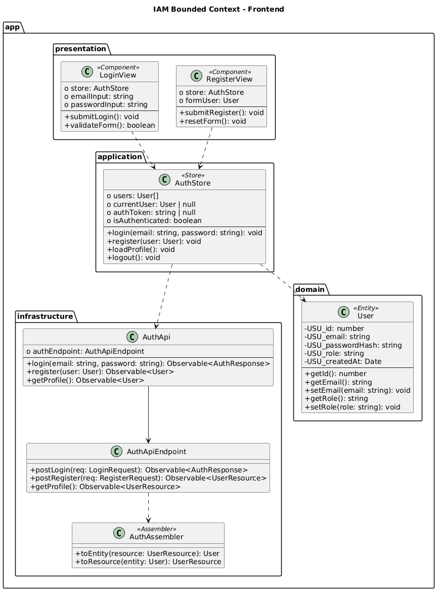

 

El módulo IAM permite a los usuarios registrarse, iniciar sesión y gestionar su sesión activa. Incluye vistas como LoginView, RegisterView y ProfileView, junto con un AuthStore que maneja el estado de autenticación y la comunicación con la API mediante Observables.

 

**Backend Components Diagrams**

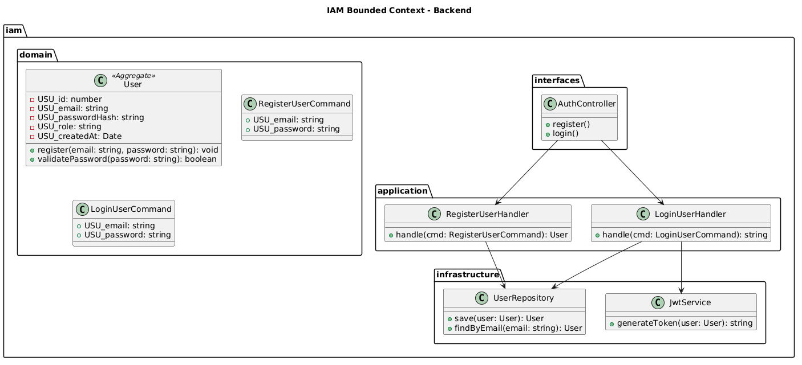

 

El módulo IAM gestiona la lógica de negocio relacionada con autenticación y control de acceso. Implementa comandos como registro e inicio de sesión, handlers para procesar dichas operaciones, repositorios para persistencia de usuarios y servicios de seguridad como generación de tokens JWT.

 

**2. Bounded Context: `Appointment Management`**

 

Este diagrama corresponde al contexto de gestión de citas, responsable de administrar la programación, modificación y cancelación de citas médicas para las mascotas. El agregado principal Appointment contiene información clave como la mascota asociada, el veterinario asignado, la fecha y el estado de la cita. Este contexto permite organizar la agenda de atención, asegurando un flujo ordenado de consultas dentro de la clínica. Además, el sistema contempla distintos estados de la cita (programada, cancelada, completada), lo que permite llevar un control preciso del ciclo de vida de cada atención.

 

**Frontend Components Diagrams**

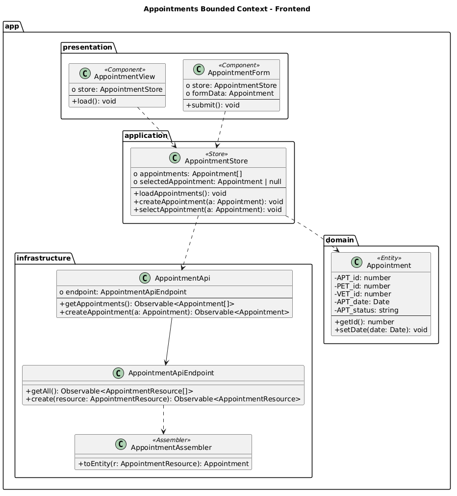

 

El módulo Appointments permite a los usuarios visualizar el calendario de citas, registrar nuevas citas y gestionar las existentes. Incluye componentes como AppointmentDashboard, AppointmentForm y AppointmentCard, junto con un AppointmentStore que gestiona el estado y sincroniza los datos con el backend.

 

**Backend Components Diagrams**

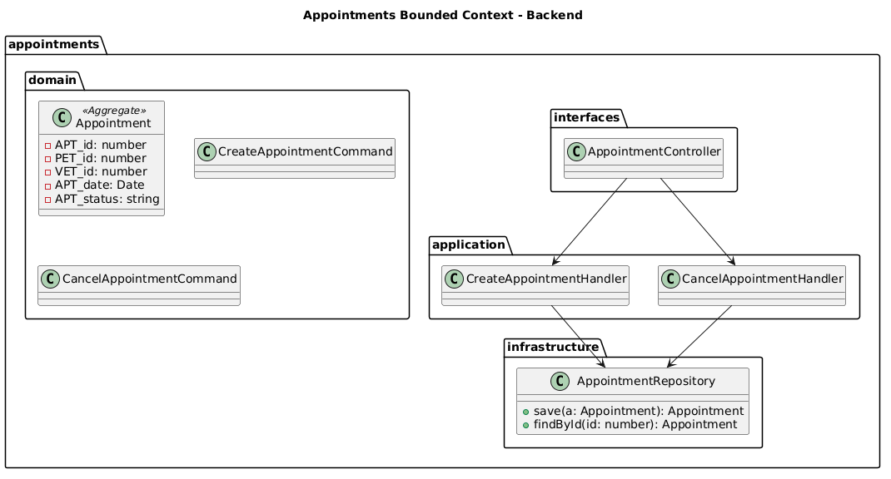

 

El módulo Appointments gestiona la lógica de negocio relacionada con la programación de citas. Implementa comandos como creación y cancelación de citas, handlers para procesar estas acciones y repositorios para la persistencia de la información.

 

**2. Bounded Context: `Clinical Management`**

 

Este diagrama corresponde al contexto principal del sistema Pawtient, encargado de la gestión clínica de las mascotas. El agregado principal Pet representa al paciente veterinario, incluyendo información como nombre, especie, raza, fecha de nacimiento y su propietario. Este contexto incluye las entidades Consultation, que registra cada atención médica con diagnóstico y tratamiento, y MedicalRecord, que almacena el historial clínico completo de la mascota, incluyendo antecedentes, alergias y observaciones. En conjunto, este contexto permite centralizar toda la información médica del paciente, facilitando el seguimiento continuo de su estado de salud y la toma de decisiones clínicas.

 

**Frontend Components Diagrams**

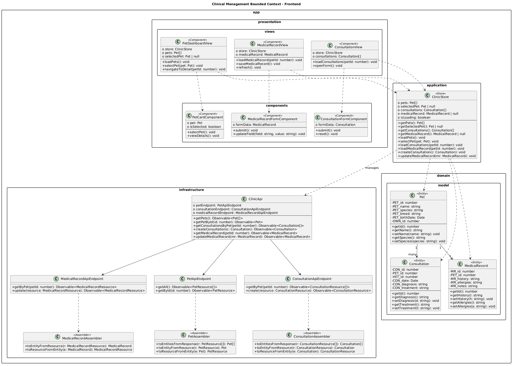

 

El módulo Clinical Management permite a los usuarios gestionar mascotas, consultas y registros médicos. Incluye vistas como PetDashboardView, ConsultationView y MedicalRecordView, junto con componentes especializados como formularios y tarjetas. El estado es gestionado por ClinicStore, que coordina la comunicación con la API y mantiene sincronizados los datos clínicos.

 

**Backend Components Diagrams**

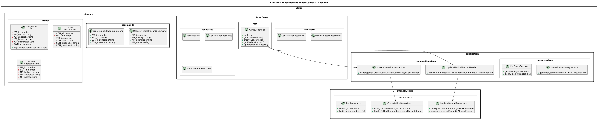

 

El módulo Clinical Management gestiona la lógica de negocio relacionada con pacientes, consultas y registros médicos. Implementa comandos como creación de consultas y actualización de historiales médicos, handlers para su procesamiento, servicios de consulta para recuperación de datos y repositorios para la persistencia de la información clínica.

 

**4. Bounded Context: `Store (Inventory)`**

 

Este diagrama corresponde al contexto de gestión de inventario, encargado de administrar los productos, proveedores y movimientos de stock dentro de la clínica veterinaria. El agregado principal Product contiene información como nombre, descripción, precio y stock disponible. Además, el modelo incluye la entidad Supplier, que representa a los proveedores de insumos, y StockMovement, que registra las entradas y salidas de productos. Este contexto permite mantener un control preciso del inventario, evitando desabastecimientos y facilitando la gestión de recursos médicos.

 

**Frontend Components Diagrams**

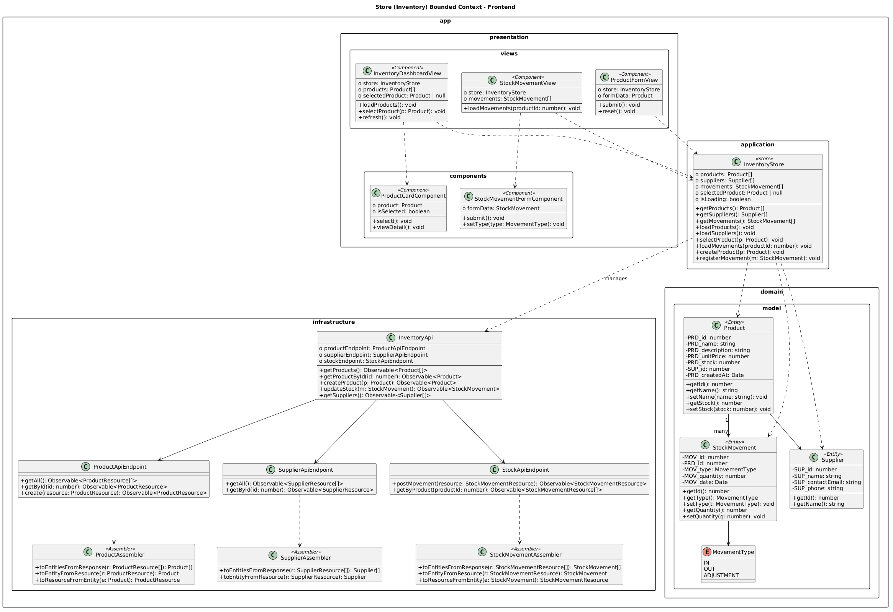

 

El módulo Store permite a los usuarios visualizar productos, registrar nuevos insumos y gestionar movimientos de inventario. Incluye vistas como InventoryDashboardView, ProductFormView y StockMovementView, junto con componentes reutilizables y un InventoryStore que maneja el estado de los productos y movimientos.

 

**Backend Components Diagrams**

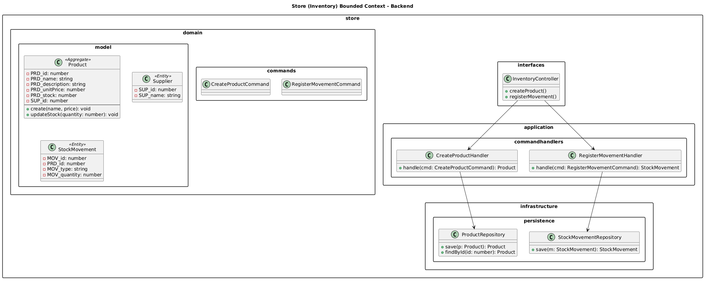

 

El módulo Store gestiona la lógica de negocio relacionada con productos y control de inventario. Implementa comandos como creación de productos y registro de movimientos, handlers correspondientes y repositorios para la persistencia de datos.

 

**5. Bounded Context: `Reports & Billing`**

 

Este diagrama corresponde al contexto de reportes y gestión financiera, encargado de generar informes y controlar la facturación dentro del sistema. El agregado principal Report permite generar distintos tipos de reportes sobre el funcionamiento de la clínica, mientras que la entidad Billing gestiona la información financiera, incluyendo montos, fechas y transacciones. Este contexto permite obtener una visión global del rendimiento del negocio, facilitando la toma de decisiones estratégicas y el control económico.

 

**Frontend Components Diagrams**

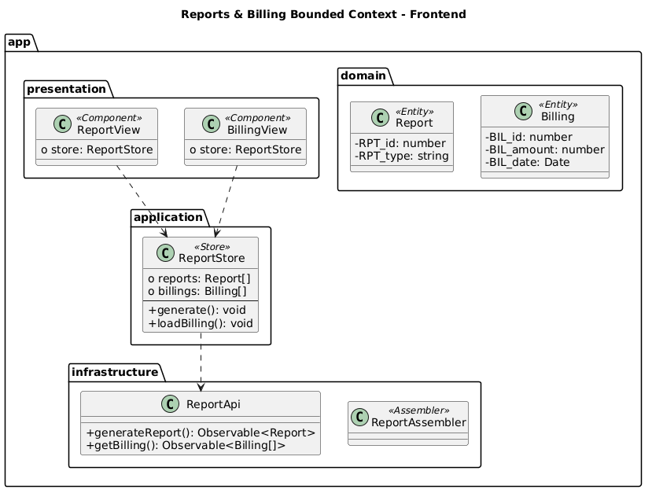

 

El módulo Reports permite a los usuarios generar reportes y visualizar información financiera. Incluye vistas como ReportView y BillingView, junto con un ReportStore que gestiona los datos y coordina la comunicación con el backend.

 

**Backend Components Diagrams**

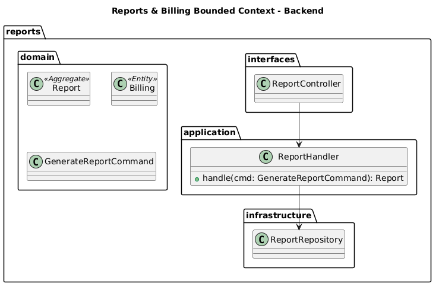

 

El módulo Reports gestiona la lógica de negocio relacionada con la generación de reportes y facturación. Implementa comandos para la generación de reportes, handlers para su procesamiento y repositorios para el almacenamiento de la información.

 

**6. Bounded Context: `Profile`**

 

Este diagrama corresponde al contexto de gestión de perfil de usuario, encargado de administrar la información personal de los usuarios dentro del sistema. El agregado principal Profile contiene datos como nombre, correo electrónico y la relación con el usuario del sistema. Este contexto permite a los usuarios actualizar su información personal y mantener sus datos actualizados dentro de la plataforma.

 

**Frontend Components Diagrams**

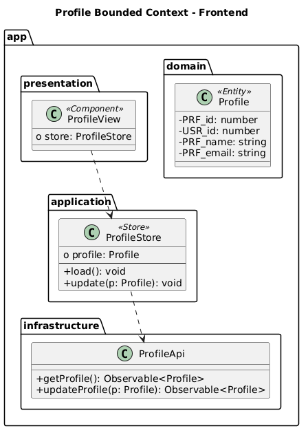

 

El módulo Profile permite a los usuarios visualizar y actualizar su información personal. Incluye la vista ProfileView y un ProfileStore que gestiona el estado del perfil y la comunicación con la API.

 

**Backend Components Diagrams**

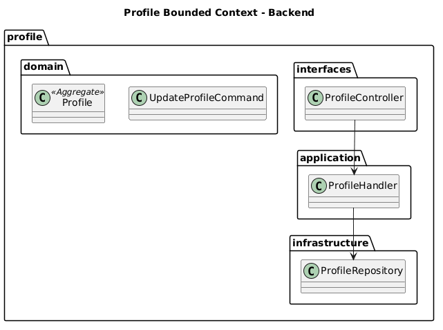

 

El módulo Profile gestiona la lógica de negocio relacionada con la actualización de perfiles de usuario. Implementa comandos de actualización, handlers y repositorios para la persistencia de datos.

 

---

## 4.8. Database Design

>*En esta sección se presenta el diseño de la base de datos del sistema Pawtient, estructurado en función de los bounded contexts definidos previamente en el modelo de dominio. El diseño sigue un enfoque relacional que permite la persistencia eficiente y consistente de la información del sistema.
El modelo incluye tablas con atributos definidos bajo una nomenclatura uniforme, así como claves primarias y foráneas que establecen relaciones entre entidades. Estas relaciones garantizan la integridad referencial y permiten mantener la coherencia de los datos entre los distintos módulos del sistema. Asimismo, la organización por bounded contexts facilita la separación de responsabilidades y la escalabilidad del sistema.*

 

### 4.8.1. Database Diagrams

>*El diagrama de base de datos de Pawtient refleja una arquitectura orientada al dominio, organizada en múltiples bounded contexts, cada uno responsable de un conjunto cohesivo de entidades. Para su elaboración se utilizó MySQL Workbench, herramienta que permitió diseñar, visualizar y estructurar las tablas, columnas y relaciones del sistema de manera clara.
Aunque el modelo es único a nivel físico, en el diagrama las tablas se agrupan visualmente según el bounded context al que pertenecen, lo que facilita la comprensión de la estructura del sistema sin generar duplicación de datos.*

 

  

**`Database Diagram`**

 

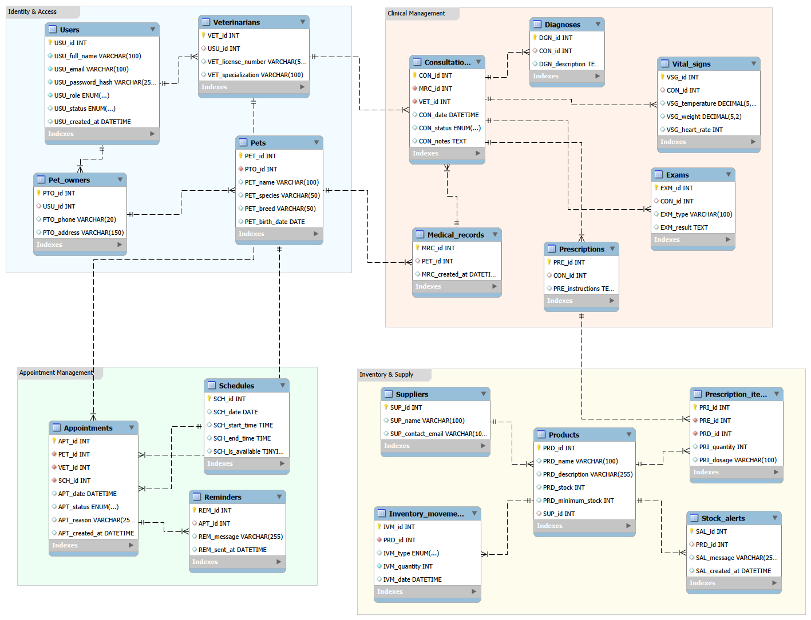

 

*Explicación:*

 

**IAM (Identity & Access)**

Este contexto gestiona la identidad y el acceso al sistema. La tabla Users centraliza la autenticación, roles y estado de los usuarios. A partir de ella se derivan Pet_owners y Veterinarians, que extienden la información según el tipo de usuario. Estas entidades permiten diferenciar claramente entre los dueños de mascotas y los profesionales veterinarios dentro del sistema.

 

**Appointment Management** 

Este contexto administra la programación de citas. La tabla Schedules define la disponibilidad de los veterinarios mediante bloques de tiempo, mientras que Appointments vincula mascotas, veterinarios y horarios, incluyendo el estado y motivo de la cita. La tabla Reminders permite registrar notificaciones asociadas a cada cita, facilitando la comunicación con los usuarios.

 

**Clinical Management** 

Este es el núcleo funcional del sistema. La tabla Medical_records actúa como raíz del historial clínico de cada mascota. A partir de ella, Consultations registra cada atención médica realizada por un veterinario. De cada consulta se derivan múltiples entidades relacionadas:

- Vital_signs, que almacena los signos vitales,
- Diagnoses, que contiene el diagnóstico,
- Prescriptions, que define el tratamiento,
- Exams, que permite registrar múltiples estudios complementarios.

Este contexto permite gestionar de forma integral la información médica de cada paciente.

 

**Store (Inventory)** 

Este contexto gestiona los recursos e insumos de la clínica. Suppliers almacena la información de proveedores, mientras que Products representa los insumos disponibles, incluyendo stock actual y mínimo. Inventory_movements registra cada movimiento de inventario (entrada, salida o ajuste), y Stock_alerts permite identificar situaciones de bajo stock.

La tabla Prescription_items conecta este contexto con el clínico, permitiendo la trazabilidad de los productos utilizados en cada tratamiento.

**Reports** 

Este contexto se encarga de la generación de reportes y análisis del sistema. No posee tablas propias en el modelo actual, ya que consume información proveniente de otros contextos como Appointments, Consultations e Inventory_movements.

Su función es consolidar y procesar estos datos para obtener indicadores y reportes, manteniendo una única fuente de verdad sin duplicar información.

**Profile** 

Este contexto gestiona la información del perfil de usuario. Se basa en la tabla Users, reutilizando sus atributos para evitar redundancia. Su responsabilidad principal es permitir la visualización y actualización de los datos personales del usuario dentro del sistema.

 

---

# Capítulo V: Product Implementation, Validation & Deployment

---

## 5.1. Software Configuration Management

### 5.1.1. Software Development Environment Configuration

---

### 5.1.2. Source Code Management

---

### 5.1.3. Source Code Style Guide & Conventions

---

### 5.1.4. Software Deployment Configuration

---

## 5.2. Landing Page, Services & Applications Implementation

### 5.2.1. Sprint 1

#### 5.2.1.1. Sprint Planning 1

---

#### 5.2.1.2. Aspect Leaders and Collaborators

---

#### 5.2.1.3. Sprint Backlog 1

---

#### 5.2.1.4. Development Evidence for Sprint Review

---

#### 5.2.1.5. Execution Evidence for Sprint Review

---

#### 5.2.1.6. Services Documentation Evidence for Sprint Review

---

#### 5.2.1.7. Software Deployment Evidence for Sprint Review

---

#### 5.2.1.8. Team Collaboration Insights during Sprint

---

## 5.3. Validation Interviews

### 5.3.1. Diseño de Entrevistas

### 5.3.2. Registro de Entrevistas

---

## 5.4. Video About-the-Product

---
 

## Conclusiones

*(Esta sección se desarrolla progresivamente en cada entrega)*

## Recomendaciones

*(Esta sección se desarrolla progresivamente en cada entrega)*

## Video About-The-Team

*(Incluir screenshot, URL de Microsoft Stream y YouTube, y timing del video)*

---

##  Bibliografía

- Lolimsa(12 de Marzo, 2024 ) _Problemas Comunes en Clínicas Veterinarias y Cómo Prevenirlos_. Recuperado el 25 de abril del 2026 de:
https://www.lolimsa.com.pe/blog/problemas-comunes-en-clinicas-veterinarias-y-como-prevenirlos/

- Rafael Antonio Gutiérrez Lerma (5 de Octubre, 2024) VetStrategies Consulting  _Los principales problemas con clientes y motivos de insatisfacción en clínicas veterinarias_. Recuperado el 25 de abril del 2026 de:  https://www.vetstrategiesconsulting.com/blog/los-principales-problemas-con-clientes-y-motivos-de-insatisfaccion-en-clinicas-veterinarias-

- Cedeno Ochoa, A., Catuto Murillo, A., & Rodas-Silva, J. (31 de agosto,2020)._Use of Web applications for the management of veterinary clinics and their impact on the improvement of administrative processes_. Recuperado el 25 de abril del 2026 de:  https://portal.amelica.org/ameli/jatsRepo/606/6062739010/index.html

---

## Anexos

### Anexo A: Participant Performance Report

*(Adjuntar como documento Word y PDF por separado)*

### Anexo B: Videos de Exposiciones

| Entrega | Título | Enlace |
|:-------:|:------:|:------:|
| AV1 | `upc-pre-202610-1asi0729-[10203]-[pethealt]-expo-av1` | `[URL Microsoft Stream]` |

---

 

*PetHealt · Aplicaciones Web · UPC 2026-10*

